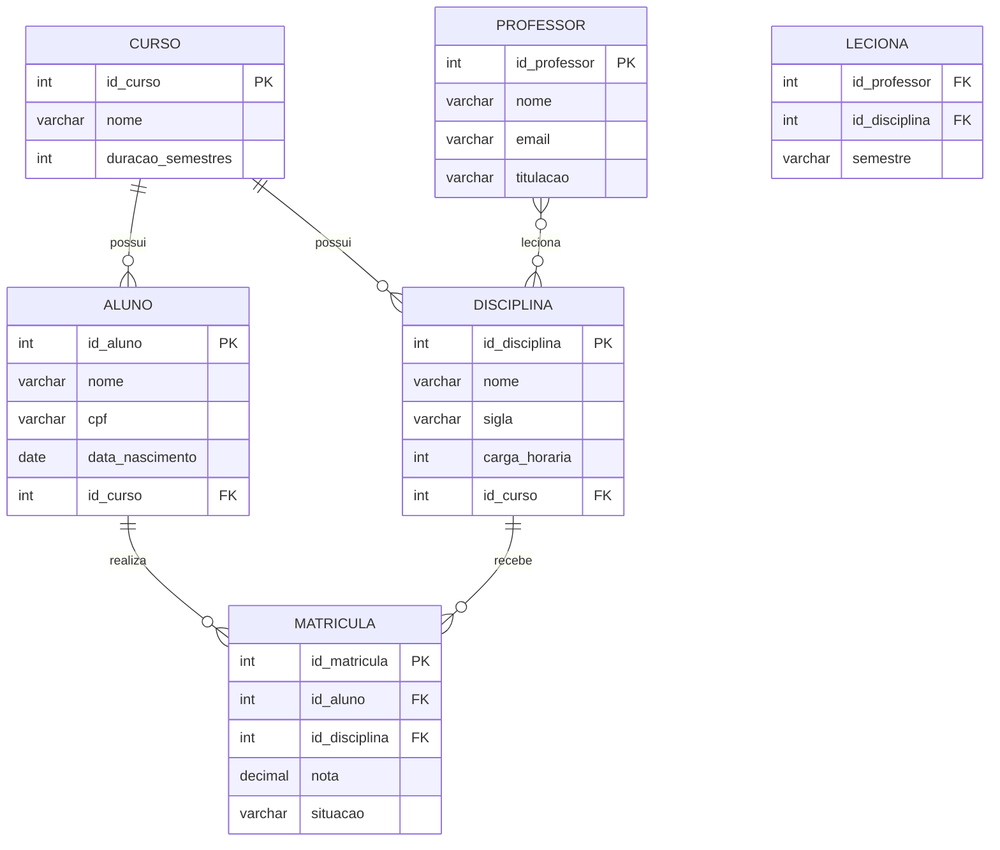

# Aula 01 — Revisão de Modelagem de Dados (Conceitual)

> **IBD015 — Banco de Dados Relacional** · Fatec Jahu · Prof. Ronan Adriel Zenatti
> [← Voltar ao README](../README.md) · [Próxima Aula →](./Aula_02_Normalizacao.md)

---

## 📌 Objetivos da Aula

Ao final desta aula, você será capaz de identificar e diferenciar os elementos fundamentais de um Modelo Entidade-Relacionamento (MER): entidades, atributos e relacionamentos. Você também saberá aplicar corretamente os conceitos de cardinalidade e participação para representar as regras de negócio de um sistema real em um diagrama conceitual.

---

## 🧭 Por que começamos pela Modelagem Conceitual?

Imagine que você foi contratado para construir um sistema de gerenciamento de uma biblioteca. Antes de escrever uma única linha de código SQL, você precisa responder: *Quais informações o sistema precisa armazenar? Como essas informações se relacionam entre si?* É exatamente para responder a essas perguntas que existe a **modelagem de dados**.

A modelagem passa por três grandes etapas, e é importante entender como elas se conectam:

A **Modelagem Conceitual** é a primeira etapa — ela é independente de qualquer tecnologia ou banco de dados específico. Aqui, o objetivo é representar o mundo real de forma abstrata, compreensível tanto pelo desenvolvedor quanto pelo cliente. Pense nela como uma planta arquitetônica: antes de construir, você desenha.

A **Modelagem Lógica** transforma esse diagrama conceitual em estruturas de tabelas, colunas e relacionamentos — ainda independente do SGBD escolhido, mas já com a linguagem do modelo relacional.

A **Modelagem Física** é a implementação final em SQL, considerando o SGBD específico (MySQL, PostgreSQL, SQL Server etc.) com seus tipos de dados, índices e particularidades.

Nesta aula, nosso foco é a **etapa conceitual**, usando a abordagem mais consagrada para isso: o **Modelo Entidade-Relacionamento**.

---

## 🎥 Vídeo de Apoio

Antes de prosseguir, este vídeo do canal **Bóson Treinamentos** oferece uma introdução clara e didática ao MER, em português:

- 📺 [Modelagem de Dados — Introdução ao MER](https://www.youtube.com/watch?v=Q_KTYFgvu1s) — Bóson Treinamentos

---

## 1. O Modelo Entidade-Relacionamento (MER)

O MER foi proposto por **Peter Chen em 1976** e até hoje é a forma mais utilizada para modelagem conceitual de bancos de dados. Ele é composto por três elementos principais: **Entidades**, **Atributos** e **Relacionamentos**. Vamos explorar cada um deles com profundidade.

---

## 2. Entidades

Uma **entidade** representa algo do mundo real sobre o qual queremos armazenar informações. Pode ser um objeto concreto (como um livro ou um produto), uma pessoa (como um aluno ou um funcionário), ou até um evento (como uma venda ou uma matrícula).

> 💡 **Regra prática:** se você consegue contar unidades daquilo e elas têm características próprias que vale a pena guardar, provavelmente é uma entidade.

Por exemplo, em um sistema de uma faculdade, as entidades naturais seriam **Aluno**, **Disciplina**, **Professor** e **Curso**. Cada aluno individual — como "João Silva, matrícula 2026001" — é chamado de **instância** ou **ocorrência** da entidade Aluno.

### 2.1 Tipos de Entidades

Existem dois tipos de entidades que você encontrará com frequência:

A **Entidade Forte** existe por si mesma, sem depender de outra entidade. Por exemplo, **Aluno** existe independentemente de qualquer outra coisa no sistema.

A **Entidade Fraca** não tem existência independente — ela só faz sentido em relação a outra entidade. O exemplo clássico é **Dependente** em relação a **Funcionário**: um dependente só existe no sistema porque está vinculado a um funcionário. Se o funcionário for removido, o dependente perde sentido.

---

## 3. Atributos

**Atributos** são as propriedades ou características de uma entidade. Se a entidade é **Produto**, seus atributos seriam `nome`, `preco`, `descricao` e `quantidade_em_estoque`.

### 3.1 Tipos de Atributos

Entender os tipos de atributos é fundamental para fazer uma modelagem precisa. Veja os principais:

**Atributo Simples (ou Atômico):** não pode ser subdividido. Exemplo: `cpf`, `data_nascimento`, `preco`.

**Atributo Composto:** pode ser dividido em partes menores com significado próprio. O clássico exemplo é `endereco`, que pode ser dividido em `rua`, `numero`, `bairro`, `cidade` e `cep`. A decisão de decompô-lo ou não depende de se o sistema precisará consultar ou filtrar por partes do endereço separadamente.

**Atributo Multivalorado:** pode ter mais de um valor para uma mesma instância. Exemplo: `telefone` de um cliente — uma pessoa pode ter vários números. Na notação do MER, representa-se com **dupla elipse**.

**Atributo Derivado:** seu valor pode ser calculado a partir de outro atributo. Exemplo: `idade` pode ser derivada de `data_nascimento`. Na notação, usa-se **elipse tracejada**.

**Atributo Chave (ou Identificador):** é o atributo cujo valor identifica unicamente cada instância da entidade. Exemplo: `cpf` para Pessoa, `matricula` para Aluno. Na notação do MER, é sublinhado.

---

## 4. Relacionamentos

Um **relacionamento** representa uma associação ou ligação entre duas ou mais entidades. No exemplo da faculdade, existe um relacionamento entre **Aluno** e **Disciplina**, pois alunos *cursam* disciplinas.

O nome dado ao relacionamento — chamado de **verbo do relacionamento** — deve descrever a natureza dessa associação do ponto de vista do negócio: *cursa*, *leciona*, *pertence a*, *realiza*.

### 4.1 Cardinalidade

A **cardinalidade** é o conceito mais importante de um relacionamento. Ela define **quantas instâncias** de uma entidade podem se associar a instâncias da outra entidade. Existem três tipos básicos:

**Um para Um (1:1):** uma instância de A se relaciona com no máximo uma instância de B, e vice-versa. Exemplo: um **Funcionário** possui um **Crachá**, e um crachá pertence a apenas um funcionário.

**Um para Muitos (1:N):** uma instância de A se relaciona com várias instâncias de B, mas cada instância de B se relaciona com apenas uma de A. Este é o mais comum! Exemplo: um **Departamento** possui muitos **Funcionários**, mas cada funcionário pertence a apenas um departamento.

**Muitos para Muitos (N:M):** uma instância de A se relaciona com várias de B, e uma instância de B se relaciona com várias de A. Exemplo: um **Aluno** cursa várias **Disciplinas**, e uma disciplina é cursada por vários alunos.

> 🔑 **Ponto de atenção:** relacionamentos N:M na modelagem conceitual são perfeitamente válidos, mas na passagem para o modelo lógico sempre serão resolvidos com a criação de uma **tabela intermediária** (também chamada de tabela associativa ou tabela de junção). Veremos isso na Aula 02.

### 4.2 Participação (ou Modalidade)

Além da cardinalidade, os relacionamentos possuem **participação**, que define se a presença em um relacionamento é obrigatória ou opcional.

A **participação total** (obrigatória) indica que toda instância da entidade *deve* participar do relacionamento. Representa-se com **linha dupla** no diagrama. Exemplo: todo **Pedido** deve estar associado a pelo menos um **Cliente** — não existe pedido sem cliente.

A **participação parcial** (opcional) indica que a entidade *pode* participar do relacionamento, mas não é obrigada. Exemplo: um **Cliente** pode ter feito zero pedidos (é um cliente cadastrado que ainda não comprou nada).

💡[Material completo sobre Cardinalidade](Cardinalidade_MER_Completo.md)

---

## 5. Notações do MER

Existem diferentes notações visuais para representar um MER. As mais comuns são:

A **Notação de Peter Chen** (a original) usa retângulos para entidades, elipses para atributos e losangos para relacionamentos. É muito utilizada em contextos acadêmicos por ser visualmente explicativa.

A **Notação Pé-de-Galinha** (*Crow's Foot*) é mais compacta e amplamente usada em ferramentas CASE e no mercado de trabalho. Representa a cardinalidade com símbolos na ponta das linhas de relacionamento que lembram garras ou pés de galinha.

Nesta disciplina, utilizaremos a **notação Crow's Foot** nos diagramas, pois é a padrão em ferramentas como MySQL Workbench, dbdiagram.io e outras que vocês usarão profissionalmente.

---

## 6. Diagrama Completo — Exemplo de Sistema Acadêmico

Vamos construir juntos um MER para um sistema acadêmico simplificado, com as seguintes regras de negócio:

- Um **Curso** possui muitas **Disciplinas**, mas cada disciplina pertence a apenas um curso.
- Um **Professor** pode lecionar várias **Disciplinas**, e uma disciplina pode ser lecionada por vários professores (em semestres diferentes, por exemplo).
- Um **Aluno** está matriculado em apenas um **Curso**, e um curso possui muitos alunos.
- Um **Aluno** pode se matricular em várias **Disciplinas**, e cada disciplina pode ter muitos alunos matriculados. Essa matrícula possui uma **nota** associada.

O diagrama abaixo representa esse modelo usando a notação Crow's Foot com Mermaid:

> 📌 **Leitura do diagrama:** a notação `||--o{` significa "um e apenas um para zero ou muitos". Lemos a linha entre CURSO e DISCIPLINA como: *"um Curso possui zero ou muitas Disciplinas, e cada Disciplina pertence a exatamente um Curso"*.

Observe que o relacionamento **N:M** entre PROFESSOR e DISCIPLINA (leciona) e entre ALUNO e DISCIPLINA (matrícula) já aparecem aqui "resolvidos" como entidades/tabelas intermediárias — **LECIONA** e **MATRICULA** — porque o Mermaid usa diretamente a notação lógica. Na modelagem conceitual pura (notação Chen), eles seriam representados como losangos. Em ferramentas profissionais, a distinção é feita de forma similar a esta.

---

## 7. Lendo as Regras de Negócio do Diagrama

Um exercício muito importante — e que cai em avaliações — é a capacidade de **ler um diagrama e extrair as regras de negócio** que ele representa, ou o inverso: receber as regras e construir o diagrama.

Treine com o diagrama acima:

Olhando a linha entre **ALUNO** e **MATRICULA**: o `||` do lado do Aluno indica participação de "um e apenas um" — cada matrícula pertence a exatamente um aluno. O `o{` do lado da Matrícula indica "zero ou muitos" — um aluno pode ter zero ou muitas matrículas. Traduzindo: *um aluno pode se matricular em zero ou muitas disciplinas, e cada matrícula pertence a exatamente um aluno*.

---

## 8. Exemplo Prático — Sistema de E-commerce (prévia)

Como a **Atividade T1** desta disciplina envolve modelar um sistema de E-commerce, vamos já começar a pensar nas entidades envolvidas. Tente identificar, a partir da descrição abaixo, quais seriam as entidades, seus atributos e relacionamentos:

> *"Uma loja virtual possui clientes que podem realizar pedidos. Cada pedido contém um ou mais produtos. Os produtos pertencem a categorias. Cada pedido possui um endereço de entrega e um status (pendente, enviado, entregue)."*

Reflita: quantas entidades você consegue identificar? Quais são os relacionamentos? Qual a cardinalidade de cada um? Na **Aula 05** você desenvolverá o modelo completo desse sistema.

---

## 9. Erros Comuns na Modelagem Conceitual

Conhecer os erros mais frequentes ajuda a evitá-los. Fique atento a:

**Criar atributo quando deveria ser entidade:** se você percebe que aquele atributo tem atributos próprios e se relaciona com outras coisas, ele provavelmente deveria ser uma entidade. Exemplo: `cidade` pode ser só um atributo de texto em Endereço, mas se o sistema precisar de dados sobre cada cidade (como estado, CEP base, etc.), `Cidade` vira uma entidade.

**Esquecer de nomear o relacionamento:** o nome do relacionamento deve expressar claramente a associação entre as entidades — evite nomes genéricos como "tem" ou "possui" quando algo mais preciso como "leciona" ou "pertence_a" descreve melhor o negócio.

**Confundir cardinalidade com quantidade de dados:** cardinalidade 1:N não significa que sempre haverá "muitos" — significa que *pode* haver muitos. Um departamento com um único funcionário ainda é uma relação 1:N.

**Modelar como N:M quando é 1:N:** isso acontece quando não se analisa com cuidado a regra de negócio. Sempre pergunte nos dois sentidos: *"Um A pode ter muitos B?"* e *"Um B pode ter muitos A?"*

---

## 🎥 Vídeos Complementares

Para reforçar o conteúdo desta aula, recomendamos os seguintes vídeos:

- 📺 [Cardinalidade no MER — Explicação Completa](https://www.youtube.com/watch?v=Q_KTYFgvu1s) — Bóson Treinamentos
- 📺 [Entidades Fortes e Fracas no Banco de Dados](https://www.youtube.com/watch?v=uwCRtxnN5e4) — Curso em Vídeo

---

## 📝 Exercícios de Fixação

**Exercício 1 — Identificação de Entidades:** leia o trecho abaixo e liste todas as entidades, atributos e relacionamentos que você consegue identificar, indicando a cardinalidade de cada relacionamento.

> *"Uma clínica médica cadastra seus pacientes e médicos. Um médico pode ter várias especialidades. Os pacientes podem agendar consultas com os médicos. Cada consulta ocorre em uma data e horário específicos e gera um prontuário com o diagnóstico e a prescrição."*

**Exercício 2 — Leitura de Diagrama:** analise o diagrama da Seção 6 e responda: é possível que um Aluno exista no banco sem estar associado a nenhum Curso? Justifique sua resposta com base na notação do diagrama.

**Exercício 3 — Modelagem Livre:** escolha um sistema do cotidiano (uma locadora, um pet shop, um restaurante) e crie um MER conceitual com pelo menos 4 entidades, identificando atributos e relacionamentos com suas cardinalidades.

---

## 📚 Referências desta Aula

- ELMASRI, R.; NAVATHE, S. B. *Sistemas de Banco de Dados*. 7 ed. Cap. 3 — Modelagem de Dados usando o Modelo Entidade-Relacionamento. São Paulo: Pearson, 2018.
- SILBERSCHATZ, A.; KORTH, H. F.; SUNDARSHAN, S. *Sistema de banco de dados*. 6 ed. Cap. 6 — Projeto de Banco de Dados usando o Modelo ER. Rio de Janeiro: Elsevier, 2016.
- DATE, C. J. *Introdução a sistemas de bancos de dados*. 8 ed. Rio de Janeiro: Elsevier/Campus, 2004.

---

> **Próxima aula:** na [Aula 02 — Normalização](./Aula_02_Normalizacao.md), veremos como transformar o modelo conceitual que acabamos de estudar em um modelo lógico, aplicando as Formas Normais para garantir a consistência e eliminar redundâncias.

---

  Fatec Jahu · IBD015 — Banco de Dados Relacional · Prof. Ronan Adriel Zenatti · 2026

