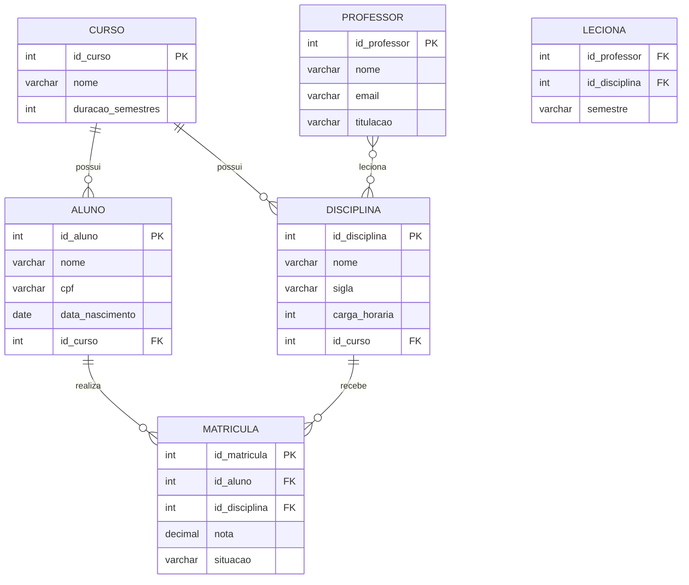

# Aula 01 — Revisão de Modelagem de Dados (Conceitual)

> **IBD015 — Banco de Dados Relacional** · Fatec Jahu · Prof. Ronan Adriel Zenatti
> [← Voltar ao README](../README.md) · [Próxima Aula →](./Aula_02_Normalizacao.md)

---

## 📌 Objetivos da Aula

Ao final desta aula, você será capaz de identificar e diferenciar os elementos fundamentais de um Modelo Entidade-Relacionamento (MER): entidades, atributos e relacionamentos. Você também saberá aplicar corretamente os conceitos de cardinalidade e participação para representar as regras de negócio de um sistema real em um diagrama conceitual. Adicionalmente, você compreenderá os mecanismos de **generalização e especialização** para modelar hierarquias entre entidades.

---

## 🧭 Por que começamos pela Modelagem Conceitual?

Imagine que você foi contratado para construir um sistema de gerenciamento de uma biblioteca. Antes de escrever uma única linha de código SQL, você precisa responder: *Quais informações o sistema precisa armazenar? Como essas informações se relacionam entre si?* É exatamente para responder a essas perguntas que existe a **modelagem de dados**.

A modelagem passa por três grandes etapas, e é importante entender como elas se conectam:


A **Modelagem Conceitual** é a primeira etapa — ela é independente de qualquer tecnologia ou banco de dados específico. Aqui, o objetivo é representar o mundo real de forma abstrata, compreensível tanto pelo desenvolvedor quanto pelo cliente. Pense nela como uma planta arquitetônica: antes de construir, você desenha.

A **Modelagem Lógica** transforma esse diagrama conceitual em estruturas de tabelas, colunas e relacionamentos — ainda independente do SGBD escolhido, mas já com a linguagem do modelo relacional.

A **Modelagem Física** é a implementação final em SQL, considerando o SGBD específico (MySQL, PostgreSQL, SQL Server etc.) com seus tipos de dados, índices e particularidades.

Nesta aula, nosso foco é a **etapa conceitual**, usando a abordagem mais consagrada para isso: o **Modelo Entidade-Relacionamento**.

---

## 🎥 Vídeo de Apoio

Antes de prosseguir, este vídeo do canal **Bóson Treinamentos** oferece uma introdução clara e didática ao MER, em português:

- 📺 [Modelagem de Dados — Introdução ao MER](https://www.youtube.com/watch?v=Q_KTYFgvu1s) — Bóson Treinamentos

---

## 1. O Modelo Entidade-Relacionamento (MER)

O MER foi proposto por **Peter Chen em 1976** e até hoje é a forma mais utilizada para modelagem conceitual de bancos de dados. Ele é composto por três elementos principais: **Entidades**, **Atributos** e **Relacionamentos**. Vamos explorar cada um deles com profundidade.

---

## 2. Entidades

Uma **entidade** representa algo do mundo real sobre o qual queremos armazenar informações. Pode ser um objeto concreto (como um livro ou um produto), uma pessoa (como um aluno ou um funcionário), ou até um evento (como uma venda ou uma matrícula).

> 💡 **Regra prática:** se você consegue contar unidades daquilo e elas têm características próprias que vale a pena guardar, provavelmente é uma entidade.

Por exemplo, em um sistema de uma faculdade, as entidades naturais seriam **Aluno**, **Disciplina**, **Professor** e **Curso**. Cada aluno individual — como "João Silva, matrícula 2026001" — é chamado de **instância** ou **ocorrência** da entidade Aluno.

### 2.1 Tipos de Entidades

Existem dois tipos de entidades que você encontrará com frequência:

A **Entidade Forte** existe por si mesma, sem depender de outra entidade. Por exemplo, **Aluno** existe independentemente de qualquer outra coisa no sistema.

A **Entidade Fraca** não tem existência independente — ela só faz sentido em relação a outra entidade. O exemplo clássico é **Dependente** em relação a **Funcionário**: um dependente só existe no sistema porque está vinculado a um funcionário. Se o funcionário for removido, o dependente perde sentido.

---

## 3. Atributos

**Atributos** são as propriedades ou características de uma entidade. Se a entidade é **Produto**, seus atributos seriam `nome`, `preco`, `descricao` e `quantidade_em_estoque`.

### 3.1 Tipos de Atributos

Entender os tipos de atributos é fundamental para fazer uma modelagem precisa. Veja os principais:

**Atributo Simples (ou Atômico):** não pode ser subdividido. Exemplo: `cpf`, `data_nascimento`, `preco`.

**Atributo Composto:** pode ser dividido em partes menores com significado próprio. O clássico exemplo é `endereco`, que pode ser dividido em `rua`, `numero`, `bairro`, `cidade` e `cep`. A decisão de decompô-lo ou não depende de se o sistema precisará consultar ou filtrar por partes do endereço separadamente.

**Atributo Multivalorado:** pode ter mais de um valor para uma mesma instância. Exemplo: `telefone` de um cliente — uma pessoa pode ter vários números. Na notação do MER, representa-se com **dupla elipse**.

**Atributo Derivado:** seu valor pode ser calculado a partir de outro atributo. Exemplo: `idade` pode ser derivada de `data_nascimento`. Na notação, usa-se **elipse tracejada**.

**Atributo Chave (ou Identificador):** é o atributo cujo valor identifica unicamente cada instância da entidade. Exemplo: `cpf` para Pessoa, `matricula` para Aluno. Na notação do MER, é sublinhado.


---

## 4. Relacionamentos

Um **relacionamento** representa uma associação ou ligação entre duas ou mais entidades. No exemplo da faculdade, existe um relacionamento entre **Aluno** e **Disciplina**, pois alunos *cursam* disciplinas.

O nome dado ao relacionamento — chamado de **verbo do relacionamento** — deve descrever a natureza dessa associação do ponto de vista do negócio: *cursa*, *leciona*, *pertence a*, *realiza*.

### 4.1 Cardinalidade

A **cardinalidade** é o conceito mais importante de um relacionamento. Ela define **quantas instâncias** de uma entidade podem se associar a instâncias da outra entidade. Existem três tipos básicos:

**Um para Um (1:1):** uma instância de A se relaciona com no máximo uma instância de B, e vice-versa. Exemplo: um **Funcionário** possui um **Crachá**, e um crachá pertence a apenas um funcionário.

**Um para Muitos (1:N):** uma instância de A se relaciona com várias instâncias de B, mas cada instância de B se relaciona com apenas uma de A. Este é o mais comum! Exemplo: um **Departamento** possui muitos **Funcionários**, mas cada funcionário pertence a apenas um departamento.

**Muitos para Muitos (N:M):** uma instância de A se relaciona com várias de B, e uma instância de B se relaciona com várias de A. Exemplo: um **Aluno** cursa várias **Disciplinas**, e uma disciplina é cursada por vários alunos.

> 🔑 **Ponto de atenção:** relacionamentos N:M na modelagem conceitual são perfeitamente válidos, mas na passagem para o modelo lógico sempre serão resolvidos com a criação de uma **tabela intermediária** (também chamada de tabela associativa ou tabela de junção). Veremos isso na Aula 02.

### 4.2 Participação (ou Modalidade)

Além da cardinalidade, os relacionamentos possuem **participação**, que define se a presença em um relacionamento é obrigatória ou opcional.

A **participação total** (obrigatória) indica que toda instância da entidade *deve* participar do relacionamento. Representa-se com **linha dupla** no diagrama. Exemplo: todo **Pedido** deve estar associado a pelo menos um **Cliente** — não existe pedido sem cliente.

A **participação parcial** (opcional) indica que a entidade *pode* participar do relacionamento, mas não é obrigada. Exemplo: um **Cliente** pode ter feito zero pedidos (é um cliente cadastrado que ainda não comprou nada).

💡[Material completo sobre Cardinalidade](Cardinalidade_MER_Completo.md)

---

## 5. Notações do MER

Existem diferentes notações visuais para representar um MER. As mais comuns são:

A **Notação de Peter Chen** (a original) usa retângulos para entidades, elipses para atributos e losangos para relacionamentos. É muito utilizada em contextos acadêmicos por ser visualmente explicativa.

A **Notação Pé-de-Galinha** (*Crow's Foot*) é mais compacta e amplamente usada em ferramentas CASE e no mercado de trabalho. Representa a cardinalidade com símbolos na ponta das linhas de relacionamento que lembram garras ou pés de galinha.

Nesta disciplina, utilizaremos a **notação Crow's Foot** nos diagramas, pois é a padrão em ferramentas como MySQL Workbench, dbdiagram.io e outras que vocês usarão profissionalmente.

---

## 6. Diagrama Completo — Exemplo de Sistema Acadêmico

Vamos construir juntos um MER para um sistema acadêmico simplificado, com as seguintes regras de negócio:

- Um **Curso** possui muitas **Disciplinas**, mas cada disciplina pertence a apenas um curso.
- Um **Professor** pode lecionar várias **Disciplinas**, e uma disciplina pode ser lecionada por vários professores (em semestres diferentes, por exemplo).
- Um **Aluno** está matriculado em apenas um **Curso**, e um curso possui muitos alunos.
- Um **Aluno** pode se matricular em várias **Disciplinas**, e cada disciplina pode ter muitos alunos matriculados. Essa matrícula possui uma **nota** associada.

O diagrama abaixo representa esse modelo usando a notação Crow's Foot com Mermaid:



> 📌 **Leitura do diagrama:** a notação `||--o{` significa "um e apenas um para zero ou muitos". Lemos a linha entre CURSO e DISCIPLINA como: *"um Curso possui zero ou muitas Disciplinas, e cada Disciplina pertence a exatamente um Curso"*.

---

## 7. Lendo as Regras de Negócio do Diagrama

Um exercício muito importante — e que cai em avaliações — é a capacidade de **ler um diagrama e extrair as regras de negócio** que ele representa, ou o inverso: receber as regras e construir o diagrama.

Treine com o diagrama acima:

Olhando a linha entre **ALUNO** e **MATRICULA**: o `||` do lado do Aluno indica participação de "um e apenas um" — cada matrícula pertence a exatamente um aluno. O `o{` do lado da Matrícula indica "zero ou muitos" — um aluno pode ter zero ou muitas matrículas. Traduzindo: *um aluno pode se matricular em zero ou muitas disciplinas, e cada matrícula pertence a exatamente um aluno*.

---

## 8. Generalização e Especialização

Até aqui modelamos entidades de forma independente. Mas e quando percebemos que duas ou mais entidades compartilham um conjunto de atributos em comum, diferindo apenas em alguns atributos específicos? É para esse cenário que existe o mecanismo de **generalização e especialização**.

### 8.1 O que é Generalização?

A **generalização** é um processo **bottom-up** (de baixo para cima): você parte de entidades específicas já identificadas e abstrai o que elas têm em comum para criar uma entidade mais genérica — chamada de **superclasse** ou **entidade genérica**.

Pense no raciocínio: *"Aluno e Professor têm nome, CPF, e-mail e data de nascimento. O que eles têm em comum pode ser abstraído em uma entidade Pessoa."* Você estava olhando para as partes e generalizou para o todo.

### 8.2 O que é Especialização?

A **especialização** é o processo inverso — **top-down** (de cima para baixo): você parte de uma entidade genérica e a divide em subtipos mais específicos — chamados de **subclasses** ou **entidades especializadas** — que possuem atributos ou relacionamentos próprios, além dos herdados da superclasse.

Pense no raciocínio: *"Uma Pessoa pode ser Cliente ou Funcionário. Clientes têm histórico de compras; Funcionários têm cargo e salário. Vou especializar Pessoa nessas duas subclasses."* Você estava olhando para o todo e especializou nas partes.

> 💡 **Na prática, generalização e especialização são dois lados da mesma moeda.** O resultado no diagrama é idêntico — uma hierarquia com superclasse e subclasses. A diferença é apenas no raciocínio que levou até lá: você subiu das partes para o todo (generalização) ou desceu do todo para as partes (especialização).

### 8.3 Herança de Atributos

A principal vantagem desse mecanismo é a **herança**: toda subclasse automaticamente herda todos os atributos e relacionamentos da superclasse, além de possuir os seus próprios.

```
PESSOA (superclasse)
│   ├── id_pessoa
│   ├── nome
│   ├── cpf
│   └── email
│
├── CLIENTE (subclasse — herda tudo de PESSOA, acrescenta:)
│       ├── data_primeiro_pedido
│       └── limite_credito
│
└── FUNCIONARIO (subclasse — herda tudo de PESSOA, acrescenta:)
        ├── cargo
        ├── salario
        └── data_admissao
```

Uma instância de CLIENTE **é uma** PESSOA — ela tem nome, CPF e e-mail (herdados), mais os atributos específicos de cliente. Esse é o princípio central da herança: a relação entre subclasse e superclasse é sempre do tipo **"é um"** (*is-a*).

### 8.4 Restrições de Generalização/Especialização

Existem duas dimensões de restrição que você deve indicar no diagrama:

#### Quanto à obrigatoriedade (participação):

**Total:** toda instância da superclasse *obrigatoriamente* pertence a pelo menos uma subclasse. Não existe uma "Pessoa genérica" — ela é sempre ou Cliente ou Funcionário (ou ambos). Representa-se com linha dupla ou a palavra `{total}` no diagrama.

**Parcial:** uma instância da superclasse *pode* não pertencer a nenhuma subclasse. Existe a possibilidade de uma "Pessoa genérica" no sistema, sem ser cliente nem funcionário. Representa-se com linha simples ou a palavra `{parcial}`.

#### Quanto à exclusividade:

**Exclusiva (disjunta):** uma instância da superclasse pertence a **no máximo uma** subclasse. Uma pessoa é ou Cliente ou Funcionário — nunca os dois ao mesmo tempo. Representa-se com a letra **d** (*disjoint*) ou o símbolo **⊕** no diagrama.

**Sobreposta (overlapping):** uma instância da superclasse pode pertencer a **mais de uma** subclasse simultaneamente. Uma pessoa pode ser Cliente e Funcionário ao mesmo tempo (ex.: um funcionário que também compra na loja onde trabalha). Representa-se com a letra **o** (*overlapping*) ou o símbolo **○**.

A combinação dessas duas dimensões gera quatro tipos possíveis:

| Tipo | Obrigatoriedade | Exclusividade | Significado |
|---|---|---|---|
| Total Exclusiva | Todo indivíduo da superclasse está em uma subclasse | Em no máximo uma | Nenhum "genérico"; subclasses não se sobrepõem |
| Total Sobreposta | Todo indivíduo está em pelo menos uma subclasse | Pode estar em mais de uma | Nenhum "genérico"; subclasses podem se sobrepor |
| Parcial Exclusiva | Pode existir "genérico" | Em no máximo uma | Subclasses não se sobrepõem |
| Parcial Sobreposta | Pode existir "genérico" | Pode estar em mais de uma | Caso mais flexível |

### 8.5 Exemplos de Generalização

**Exemplo 1 — Generalização de Veículos:**

Ao modelar um sistema de locadora, você identificou separadamente as entidades **Carro**, **Moto** e **Caminhão**. Percebeu que todas têm placa, ano de fabricação, cor e quilometragem. Ao generalizar, você cria **Veículo** como superclasse.

```mermaid
erDiagram
    VEICULO {
        int id_veiculo PK
        varchar placa
        int ano_fabricacao
        varchar cor
        int quilometragem
    }

    CARRO {
        int id_veiculo PK_FK
        int numero_portas
        varchar tipo_cambio
    }

    MOTO {
        int id_veiculo PK_FK
        varchar cilindrada
        tinyint tem_sidecar
    }

    CAMINHAO {
        int id_veiculo PK_FK
        decimal capacidade_carga_ton
        int numero_eixos
    }

    VEICULO ||--o| CARRO     : "é um"
    VEICULO ||--o| MOTO      : "é um"
    VEICULO ||--o| CAMINHAO  : "é um"
```

Restrição: **Total Exclusiva** — todo veículo cadastrado é obrigatoriamente um carro, uma moto ou um caminhão; e não pode ser dois ao mesmo tempo.

---

**Exemplo 2 — Generalização de Contas Bancárias:**

Em um sistema bancário, você identificou **Conta Corrente** e **Conta Poupança**. Ambas têm número de conta, saldo e data de abertura. Ao generalizar: **Conta** é a superclasse.

```mermaid
erDiagram
    CONTA {
        int id_conta PK
        varchar numero_conta
        decimal saldo
        date data_abertura
        int id_cliente FK
    }

    CONTA_CORRENTE {
        int id_conta PK_FK
        decimal limite_cheque_especial
        decimal taxa_manutencao
    }

    CONTA_POUPANCA {
        int id_conta PK_FK
        decimal taxa_rendimento
        date data_aniversario
    }

    CONTA ||--o| CONTA_CORRENTE : "é uma"
    CONTA ||--o| CONTA_POUPANCA : "é uma"
```

Restrição: **Total Exclusiva** — toda conta é corrente ou poupança, nunca as duas.

---

**Exemplo 3 — Generalização de Pessoas em um Hospital:**

Ao modelar um sistema hospitalar, você identificou **Médico**, **Enfermeiro** e **Paciente** como entidades separadas. Todas têm nome, CPF, data de nascimento e telefone. Ao generalizar: **Pessoa** é a superclasse.

```mermaid
erDiagram
    PESSOA {
        int id_pessoa PK
        varchar nome
        char cpf
        date data_nascimento
        char telefone
    }

    MEDICO {
        int id_pessoa PK_FK
        varchar crm
        varchar especialidade
    }

    ENFERMEIRO {
        int id_pessoa PK_FK
        varchar coren
        varchar turno
    }

    PACIENTE {
        int id_pessoa PK_FK
        varchar convenio
        varchar tipo_sanguineo
    }

    PESSOA ||--o| MEDICO      : "é uma"
    PESSOA ||--o| ENFERMEIRO  : "é uma"
    PESSOA ||--o| PACIENTE    : "é uma"
```

Restrição: **Parcial Sobreposta** — uma pessoa pode ser médico e paciente ao mesmo tempo (um médico que se interna no hospital onde trabalha), e também pode existir uma pessoa cadastrada que ainda não se enquadrou em nenhuma subclasse.

### 8.6 Exemplos de Especialização

**Exemplo 1 — Especialização de Funcionário:**

Ao modelar um sistema de RH, você tem a entidade **Funcionário** com nome, CPF, salário e data de admissão. Percebe que alguns funcionários são **Gerentes** (com bônus e equipe sob responsabilidade) e outros são **Técnicos** (com certificações). Você especializa Funcionário nessas subclasses.

```mermaid
erDiagram
    FUNCIONARIO {
        int id_funcionario PK
        varchar nome
        char cpf
        decimal salario
        date data_admissao
    }

    GERENTE {
        int id_funcionario PK_FK
        decimal bonus_anual
        int tamanho_equipe
    }

    TECNICO {
        int id_funcionario PK_FK
        varchar area_tecnica
        varchar nivel_certificacao
    }

    FUNCIONARIO ||--o| GERENTE  : "é um"
    FUNCIONARIO ||--o| TECNICO  : "é um"
```

Restrição: **Parcial Sobreposta** — nem todo funcionário é gerente ou técnico (pode ser outro tipo); e um funcionário pode acumular as duas funções.

---

**Exemplo 2 — Especialização de Produto em E-commerce:**

Em uma loja virtual, a entidade **Produto** tem nome, preço, estoque e descrição. Ao analisar o catálogo, você identifica que produtos físicos precisam de peso e dimensões para frete, enquanto produtos digitais precisam de URL de download e tamanho em MB. Você especializa Produto.

```mermaid
erDiagram
    PRODUTO {
        int id_produto PK
        varchar nome
        decimal preco
        int estoque
        text descricao
    }

    PRODUTO_FISICO {
        int id_produto PK_FK
        decimal peso_kg
        decimal altura_cm
        decimal largura_cm
        decimal profundidade_cm
    }

    PRODUTO_DIGITAL {
        int id_produto PK_FK
        varchar url_download
        decimal tamanho_mb
        int validade_dias
    }

    PRODUTO ||--o| PRODUTO_FISICO   : "é um"
    PRODUTO ||--o| PRODUTO_DIGITAL  : "é um"
```

Restrição: **Total Exclusiva** — todo produto é obrigatoriamente físico ou digital; nunca os dois.

---

**Exemplo 3 — Especialização de Conteúdo em Streaming:**

Em uma plataforma de streaming, a entidade **Conteudo** agrupa tudo que pode ser reproduzido: tem título, duração e data de lançamento. Ao especializar, você identifica **Musica** (com letra e álbum) e **Filme** (com sinopse e classificação etária) como subclasses com atributos e relacionamentos distintos.

```mermaid
erDiagram
    CONTEUDO {
        int id_conteudo PK
        varchar titulo
        int duracao_segundos
        date data_lancamento
    }

    MUSICA {
        int id_conteudo PK_FK
        text letra
        int id_album FK
    }

    FILME {
        int id_conteudo PK_FK
        text sinopse
        varchar classificacao_etaria
    }

    ALBUM {
        int id_album PK
        varchar titulo
        varchar url_capa
    }

    CONTEUDO ||--o| MUSICA  : "é um"
    CONTEUDO ||--o| FILME   : "é um"
    ALBUM    ||--o{ MUSICA  : "contém"
```

Restrição: **Total Exclusiva** — todo conteúdo cadastrado é música ou filme; e um conteúdo não pode ser os dois ao mesmo tempo. Este é exatamente o padrão que resolve o problema do **item de playlist** mencionado na Atividade T1.

### 8.7 Passagem para o Modelo Lógico

A hierarquia de generalização/especialização não tem representação direta no modelo relacional — ela precisa ser mapeada para tabelas. Existem três estratégias, cada uma com vantagens e desvantagens:

**Estratégia 1 — Uma tabela por hierarquia inteira:** cria-se uma única tabela com todas as colunas da superclasse e de todas as subclasses. Colunas que não se aplicam a uma subclasse ficam NULL. Simples de implementar, mas gera muitos NULLs e mistura dados de naturezas diferentes.

```sql
-- Exemplo: Produto com tudo em uma tabela
CREATE TABLE produtos (
    id_produto   INT UNSIGNED NOT NULL AUTO_INCREMENT,
    nome         VARCHAR(150) NOT NULL,
    preco        DECIMAL(10,2) NOT NULL,
    tipo         ENUM('fisico','digital') NOT NULL,  -- discriminador
    -- colunas de produto físico (NULL para digitais):
    peso_kg      DECIMAL(8,3) NULL,
    -- colunas de produto digital (NULL para físicos):
    url_download VARCHAR(500) NULL,
    tamanho_mb   DECIMAL(10,2) NULL,
    ...
);
```

**Estratégia 2 — Uma tabela por subclasse (com JOIN):** cria-se uma tabela para a superclasse e uma tabela para cada subclasse. A PK da subclasse é também FK para a superclasse. É o padrão mais fiel ao modelo conceitual e o adotado nesta disciplina.

```sql
-- Tabela da superclasse
CREATE TABLE produtos (
    id_produto INT UNSIGNED NOT NULL AUTO_INCREMENT,
    nome       VARCHAR(150) NOT NULL,
    preco      DECIMAL(10,2) NOT NULL,
    CONSTRAINT pk_produto PRIMARY KEY (id_produto)
) ENGINE=InnoDB ...;

-- Tabela da subclasse (PK = FK para superclasse)
CREATE TABLE produtos_fisicos (
    id_produto INT UNSIGNED NOT NULL,
    peso_kg    DECIMAL(8,3) NOT NULL,
    CONSTRAINT pk_prod_fisico  PRIMARY KEY (id_produto),
    CONSTRAINT fk_prod_fisico  FOREIGN KEY (id_produto)
        REFERENCES produtos (id_produto) ON DELETE CASCADE
) ENGINE=InnoDB ...;
```

**Estratégia 3 — Uma tabela por subclasse (sem superclasse):** cada subclasse tem sua própria tabela com todos os atributos, inclusive os herdados da superclasse. Evita JOINs, mas duplica a definição dos atributos comuns.

> 📌 **Nesta disciplina, adotaremos sempre a Estratégia 2** — uma tabela para a superclasse e uma tabela para cada subclasse, com a PK da subclasse sendo também FK para a superclasse. É a estratégia mais coerente com os princípios de normalização que estudaremos na Aula 02.

---

## 9. Diagrama Completo — Exemplo de Sistema Acadêmico

Vamos construir juntos um MER para um sistema acadêmico simplificado, com as seguintes regras de negócio:

- Um **Curso** possui muitas **Disciplinas**, mas cada disciplina pertence a apenas um curso.
- Um **Professor** pode lecionar várias **Disciplinas**, e uma disciplina pode ser lecionada por vários professores (em semestres diferentes, por exemplo).
- Um **Aluno** está matriculado em apenas um **Curso**, e um curso possui muitos alunos.
- Um **Aluno** pode se matricular em várias **Disciplinas**, e cada disciplina pode ter muitos alunos matriculados. Essa matrícula possui uma **nota** associada.

O diagrama abaixo representa esse modelo usando a notação Crow's Foot com Mermaid:


> 📌 **Leitura do diagrama:** a notação `||--o{` significa "um e apenas um para zero ou muitos". Lemos a linha entre CURSO e DISCIPLINA como: *"um Curso possui zero ou muitas Disciplinas, e cada Disciplina pertence a exatamente um Curso"*.

Observe que o relacionamento **N:M** entre PROFESSOR e DISCIPLINA (leciona) e entre ALUNO e DISCIPLINA (matrícula) já aparecem aqui "resolvidos" como entidades/tabelas intermediárias — **LECIONA** e **MATRICULA** — porque o Mermaid usa diretamente a notação lógica. Na modelagem conceitual pura (notação Chen), eles seriam representados como losangos. Em ferramentas profissionais, a distinção é feita de forma similar a esta.

---

## 10. Exemplo Prático — Sistema de Streaming (prévia do T1)

Como a **Atividade T1** desta disciplina envolve modelar um sistema de streaming integrado, vamos já começar a pensar nas entidades envolvidas. Tente identificar, a partir da descrição abaixo, quais seriam as entidades, seus atributos e relacionamentos — e onde caberia uma generalização ou especialização:

> *"Uma plataforma de streaming oferece músicas e filmes para seus usuários. As músicas fazem parte de álbuns de artistas; os filmes têm diretores e elenco. Os usuários podem criar playlists que misturem músicas e filmes na ordem que quiserem."*

Reflita: o que músicas e filmes têm em comum? Faz sentido criar uma superclasse? Qual seria a restrição (total/parcial, exclusiva/sobreposta)? Como o item de playlist referenciaria os dois tipos de conteúdo? Na **Aula 05** você desenvolverá o modelo completo desse sistema.

---

## 11. Erros Comuns na Modelagem Conceitual

Conhecer os erros mais frequentes ajuda a evitá-los. Fique atento a:

**Criar atributo quando deveria ser entidade:** se você percebe que aquele atributo tem atributos próprios e se relaciona com outras coisas, ele provavelmente deveria ser uma entidade. Exemplo: `cidade` pode ser só um atributo de texto em Endereço, mas se o sistema precisar de dados sobre cada cidade (como estado, CEP base, etc.), `Cidade` vira uma entidade.

**Esquecer de nomear o relacionamento:** o nome do relacionamento deve expressar claramente a associação entre as entidades — evite nomes genéricos como "tem" ou "possui" quando algo mais preciso como "leciona" ou "pertence_a" descreve melhor o negócio.

**Confundir cardinalidade com quantidade de dados:** cardinalidade 1:N não significa que sempre haverá "muitos" — significa que *pode* haver muitos. Um departamento com um único funcionário ainda é uma relação 1:N.

**Modelar como N:M quando é 1:N:** isso acontece quando não se analisa com cuidado a regra de negócio. Sempre pergunte nos dois sentidos: *"Um A pode ter muitos B?"* e *"Um B pode ter muitos A?"*

**Usar generalização quando não há atributos específicos:** se as subclasses candidatas não têm nenhum atributo ou relacionamento próprio além dos herdados, a hierarquia provavelmente é desnecessária. Use uma coluna `tipo` com `CHECK` na própria entidade e evite complexidade sem benefício.

**Confundir generalização com relacionamento comum:** a relação "é um" (herança) é fundamentalmente diferente de "tem um" (associação). Gerente **é um** Funcionário — isso é herança. Funcionário **tem um** Departamento — isso é relacionamento. Aplique generalização somente quando a relação semântica for realmente de subtipagem.

---

## 🎥 Vídeos Complementares

Para reforçar o conteúdo desta aula, recomendamos os seguintes vídeos:

- 📺 [Cardinalidade no MER — Explicação Completa](https://www.youtube.com/watch?v=Q_KTYFgvu1s) — Bóson Treinamentos
- 📺 [Entidades Fortes e Fracas no Banco de Dados](https://www.youtube.com/watch?v=uwCRtxnN5e4) — Curso em Vídeo
- 📺 [Generalização e Especialização no MER](https://www.youtube.com/watch?v=lSqiJ5gUSNI) — Bóson Treinamentos

---

## 📝 Exercícios de Fixação

**Exercício 1 — Identificação de Entidades:** leia o trecho abaixo e liste todas as entidades, atributos e relacionamentos que você consegue identificar, indicando a cardinalidade de cada relacionamento.

> *"Uma clínica médica cadastra seus pacientes e médicos. Um médico pode ter várias especialidades. Os pacientes podem agendar consultas com os médicos. Cada consulta ocorre em uma data e horário específicos e gera um prontuário com o diagnóstico e a prescrição."*

**Exercício 2 — Leitura de Diagrama:** analise o diagrama da Seção 9 e responda: é possível que um Aluno exista no banco sem estar associado a nenhum Curso? Justifique sua resposta com base na notação do diagrama.

**Exercício 3 — Modelagem Livre:** escolha um sistema do cotidiano (uma locadora, um pet shop, um restaurante) e crie um MER conceitual com pelo menos 4 entidades, identificando atributos e relacionamentos com suas cardinalidades.

**Exercício 4 — Generalização:** leia as entidades abaixo e identifique quais poderiam ser reunidas em uma superclasse. Proponha o nome da superclasse, liste os atributos que seriam herdados e os que permaneceriam em cada subclasse. Indique também o tipo de restrição (total/parcial, exclusiva/sobreposta) e justifique.

> Entidades: **Aluno**, **Professor**, **Funcionário Administrativo** — todos de uma faculdade.

**Exercício 5 — Especialização:** dada a entidade **Pagamento** com atributos `id_pagamento`, `valor`, `data` e `status`, especialize-a em pelo menos três subclasses que representem formas de pagamento diferentes. Para cada subclasse, liste os atributos específicos e indique o tipo de restrição da hierarquia.

---

## 📚 Referências desta Aula

- ELMASRI, R.; NAVATHE, S. B. *Sistemas de Banco de Dados*. 7 ed. Cap. 3 — Modelagem de Dados usando o Modelo Entidade-Relacionamento; Cap. 4 — Modelo ER Estendido. São Paulo: Pearson, 2018.
- SILBERSCHATZ, A.; KORTH, H. F.; SUNDARSHAN, S. *Sistema de banco de dados*. 6 ed. Cap. 6 — Projeto de Banco de Dados usando o Modelo ER. Rio de Janeiro: Elsevier, 2016.
- DATE, C. J. *Introdução a sistemas de bancos de dados*. 8 ed. Rio de Janeiro: Elsevier/Campus, 2004.

---

> **Próxima aula:** na [Aula 02 — Normalização](./Aula_02_Normalizacao.md), veremos como transformar o modelo conceitual que acabamos de estudar em um modelo lógico, aplicando as Formas Normais para garantir a consistência e eliminar redundâncias.

---

<div align="center">
  <sub>Fatec Jahu · IBD015 — Banco de Dados Relacional · Prof. Ronan Adriel Zenatti · 2026</sub>
</div>
