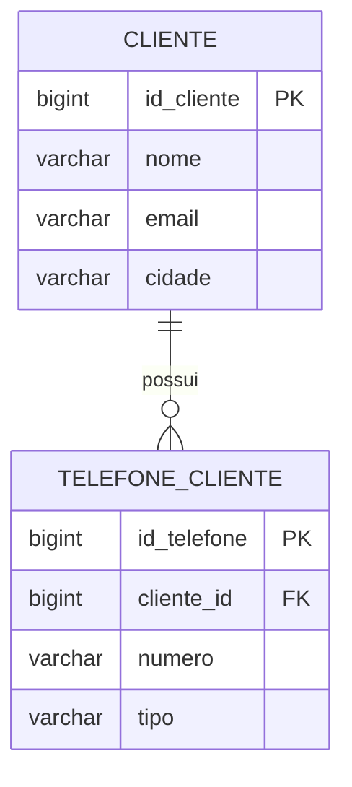
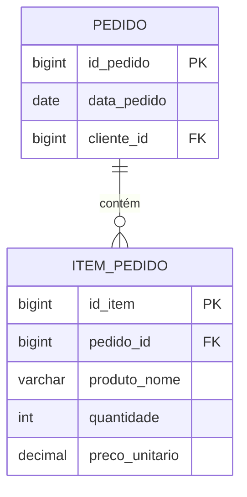
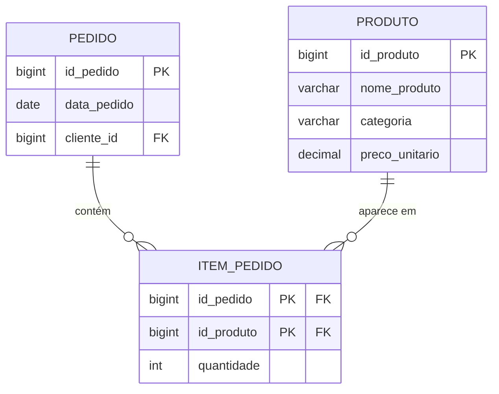
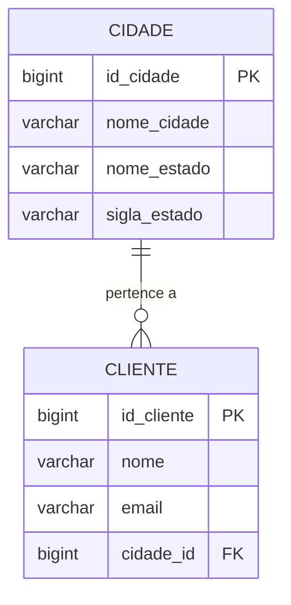
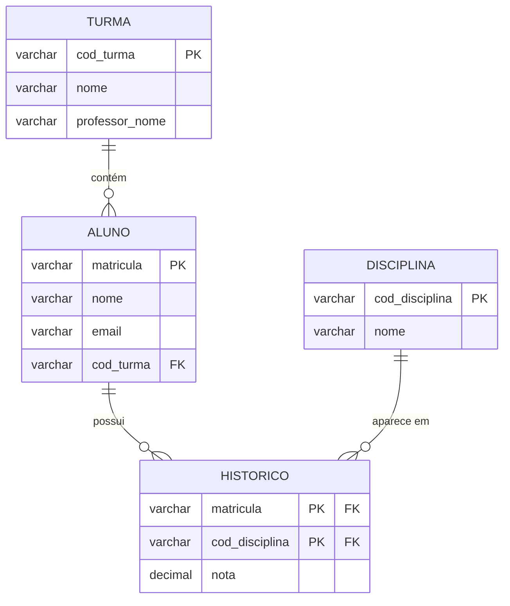
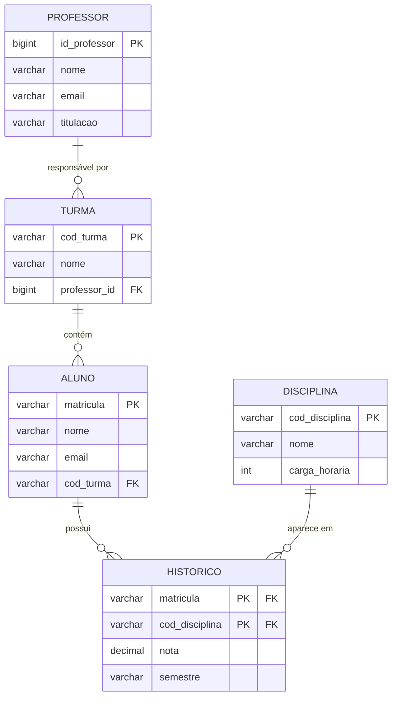
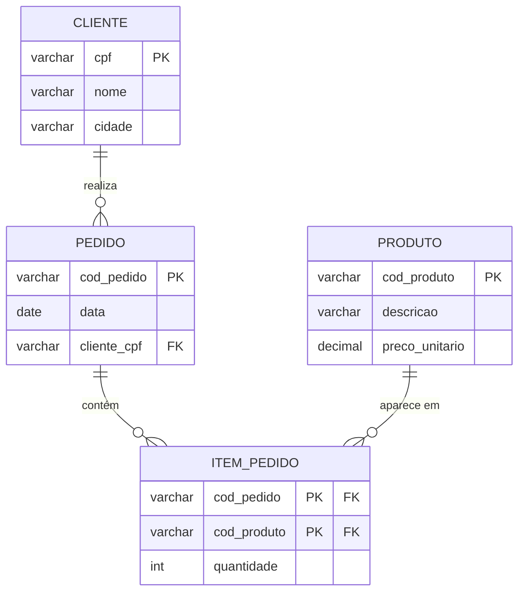
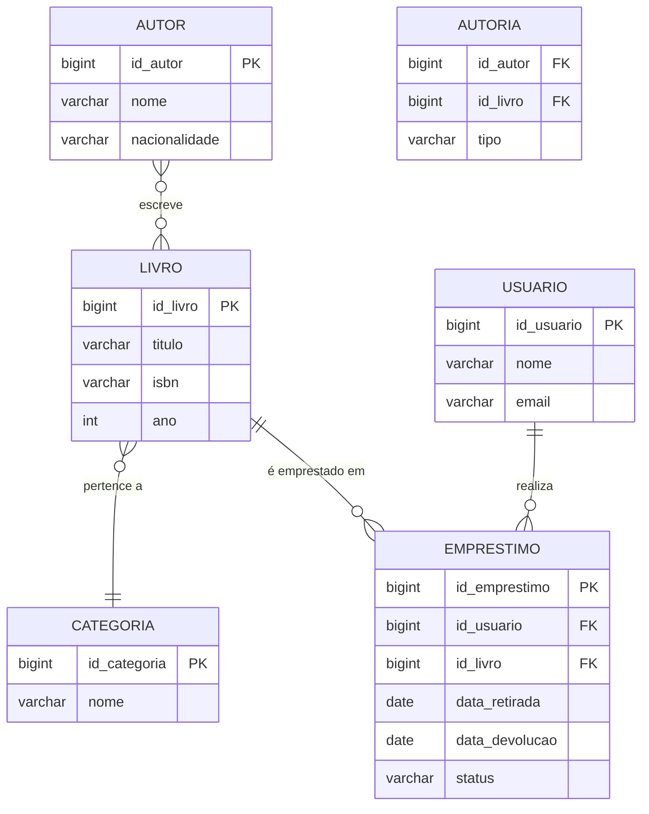

# Aula 02 — Normalização e Passagem ao Modelo Lógico Relacional

> **IBD015 — Banco de Dados Relacional** · Fatec Jahu · Prof. Ronan Adriel Zenatti
> [← Aula 01](./Aula_01_Revisao_Modelagem_Conceitual.md) · [Voltar ao README](../README.md) · [Próxima Aula →](./Aula_03_SQL_DDL.md)

---

## 📌 Objetivos da Aula

Ao final desta aula, você será capaz de identificar dependências funcionais em um conjunto de dados, reconhecer anomalias de inserção, atualização e exclusão causadas por uma estrutura mal projetada, aplicar as três primeiras Formas Normais para reorganizar tabelas de forma consistente e não redundante, e realizar a passagem do modelo conceitual (MER) para o modelo lógico relacional com critérios formais.

---

## 🧭 Por onde começar?

Na Aula 01 você aprendeu a representar um domínio de negócio como um diagrama de entidades e relacionamentos. Mas um diagrama conceitual bem feito ainda não é um banco de dados — é uma representação abstrata do problema. Para sair do diagrama e chegar às tabelas que realmente vão existir no sistema, precisamos percorrer duas etapas complementares que serão o foco desta aula.

A primeira é a **normalização**: um processo analítico e matemático, baseado em teoria de conjuntos e álgebra relacional, que garante que cada tabela do banco armazene apenas o que lhe compete, eliminando redundâncias e prevenindo inconsistências. A segunda é a **passagem ao modelo lógico**: a tradução sistemática do MER para um conjunto de tabelas relacionais, seguindo regras precisas para cada tipo de relacionamento.


Esses dois processos se complementam: você pode chegar ao modelo lógico pela normalização de tabelas existentes (quando há um banco legado, por exemplo) ou pela passagem direta do MER (quando está projetando do zero). Em ambos os casos, o resultado ideal deve satisfazer as mesmas regras formais. Por isso, estudaremos os dois caminhos.

---

## 1. O Problema que a Normalização Resolve

Antes de falar sobre as formas normais em si, é essencial entender *o que acontece quando não normalizamos*. Veja a tabela abaixo, que registra pedidos de uma loja:

| id_pedido | data_pedido | cliente_nome | cliente_email       | cliente_cidade | produto_nome | produto_preco | quantidade |
|-----------|-------------|--------------|---------------------|----------------|--------------|---------------|------------|
| 1         | 2026-03-10  | Ana Lima     | ana@email.com       | São Paulo      | Notebook     | 3500.00       | 1          |
| 1         | 2026-03-10  | Ana Lima     | ana@email.com       | São Paulo      | Mouse        | 120.00        | 2          |
| 2         | 2026-03-11  | Carlos Melo  | carlos@email.com    | Campinas       | Notebook     | 3500.00       | 1          |
| 3         | 2026-03-12  | Ana Lima     | ana@email.com       | São Paulo      | Teclado      | 250.00        | 1          |

À primeira vista, essa tabela parece "completa" — tem tudo em um lugar só. Mas observe com atenção os problemas que ela carrega:

**Anomalia de Inserção:** como cadastrar um novo produto no sistema se ele ainda não foi pedido por ninguém? Não é possível — precisaríamos criar um pedido fictício ou deixar campos em branco, o que viola a integridade.

**Anomalia de Atualização:** se Ana Lima mudar de cidade (digamos, de São Paulo para Jundiaí), precisamos atualizar *todas as linhas* onde ela aparece. Se atualizarmos apenas uma linha, a base ficará inconsistente, com Ana morando em duas cidades ao mesmo tempo.

**Anomalia de Exclusão:** se o pedido 2 for cancelado e a linha for removida, perdemos para sempre a informação de que Carlos Melo é cliente do sistema — junto com seu e-mail e cidade. A remoção de um dado elimina outro dado não relacionado.

Esses três tipos de anomalias — **inserção, atualização e exclusão** — são o sintoma mais visível de um banco desnormalizado. A normalização é o processo de reorganizar as tabelas para eliminar essas anomalias de forma sistemática e matematicamente fundamentada.

---

## 2. Dependências Funcionais — O Alicerce da Normalização

Toda a teoria da normalização é construída sobre um único conceito central: a **dependência funcional**. É fundamental dominar esse conceito antes de avançar para as formas normais.

### 2.1 Definição

Dizemos que o atributo **B** é **funcionalmente dependente** de **A** (notação: **A → B**, lê-se "A determina B") quando, para cada valor de A, existe **exatamente um** valor correspondente de B. Em outras palavras: conhecendo o valor de A, você consegue determinar o valor de B sem ambiguidade.

Pense assim: `cpf → nome_cliente`. Dado o CPF de uma pessoa, há exatamente um nome correspondente — você não pode ter dois nomes diferentes para o mesmo CPF. Portanto, o CPF *determina funcionalmente* o nome.

Atenção: a relação **não é necessariamente bidirecional**. `nome_cliente → cpf` provavelmente não é uma dependência funcional, porque duas pessoas diferentes podem ter o mesmo nome.

### 2.2 Dependência Funcional Parcial

Ocorre quando um atributo não-chave depende de **apenas parte** de uma chave composta — não da chave inteira. Esse tipo de dependência é exatamente o que viola a Segunda Forma Normal.

Exemplo: em uma tabela com chave primária composta por `(id_pedido, id_produto)`, o atributo `preco_produto` depende apenas de `id_produto` — independentemente do pedido. Isso é uma dependência parcial.

```
(id_pedido, id_produto) → quantidade        ← dependência TOTAL da chave composta
id_produto              → preco_produto     ← dependência PARCIAL (só parte da chave)
```

### 2.3 Dependência Funcional Transitiva

Ocorre quando um atributo não-chave depende de outro atributo não-chave, que por sua vez depende da chave primária. Forma uma "cadeia" de dependências.

Exemplo: `id_funcionario → id_departamento → nome_departamento`. O nome do departamento depende do ID do departamento, que depende do ID do funcionário. O `nome_departamento` é transitivamente dependente de `id_funcionario`.

```
id_funcionario → id_departamento → nome_departamento
     (chave)       (não-chave)         (não-chave)
```

Esse tipo de dependência é o que viola a Terceira Forma Normal.


### 2.4 Como Identificar Dependências Funcionais na Prática

Uma técnica muito útil é fazer a **pergunta de determinação** para cada par de atributos:

> *"Dado um valor de [A], existe sempre um único valor de [B]?"*

Se a resposta for **sim**, existe uma dependência funcional A → B. Se a resposta for **não** (pode haver vários valores de B para um mesmo valor de A), não há dependência funcional nessa direção.

Vamos aplicar isso à tabela de pedidos da Seção 1:

- `id_pedido → data_pedido`? Sim — cada pedido tem uma única data. ✅ Dependência funcional.
- `id_pedido → cliente_nome`? Sim — cada pedido pertence a um único cliente. ✅
- `produto_nome → produto_preco`? Sim — cada produto tem um preço fixo (supondo isso). ✅
- `id_pedido → produto_nome`? **Não** — um pedido pode ter vários produtos. ❌ Não é DF.
- `cliente_nome → cliente_cidade`? Sim (assumindo nome único). ✅ Mas é um atributo determinando outro atributo — isso é **transitivo** se `cliente_nome` não for a chave primária.

Identificar todas as dependências funcionais de uma tabela é o primeiro passo antes de aplicar qualquer forma normal.

---

## 3. Primeira Forma Normal (1FN)

### 3.1 Definição

Uma tabela está na **Primeira Forma Normal** quando:

1. Todos os atributos contêm apenas **valores atômicos** (indivisíveis — um único valor por célula);
2. Não existem **grupos repetidos** ou atributos multivalorados;
3. Existe uma **chave primária** que identifica unicamente cada linha.

A 1FN é o requisito mínimo para que uma estrutura possa ser chamada de tabela relacional. Sem ela, não estamos dentro do modelo relacional.

### 3.2 Violações Comuns da 1FN

**Violação por valor não-atômico:** armazenar múltiplos valores em uma única célula.

| id_cliente | nome       | telefones                        |
|------------|------------|----------------------------------|
| 1          | Ana Lima   | (14) 99999-0001, (14) 3222-1111  |
| 2          | Carlos Melo| (19) 98888-0002                  |

A coluna `telefones` armazena múltiplos valores separados por vírgula — isso viola a atomicidade. Não é possível consultar apenas o DDD 14, por exemplo, sem recorrer a manipulações de texto.

**Violação por grupos repetidos:** criar colunas numeradas para representar listas.

| id_pedido | produto_1   | qtd_1 | produto_2 | qtd_2 | produto_3 | qtd_3 |
|-----------|-------------|-------|-----------|-------|-----------|-------|
| 1         | Notebook    | 1     | Mouse     | 2     | NULL      | NULL  |
| 2         | Teclado     | 1     | NULL      | NULL  | NULL      | NULL  |

Aqui, tentou-se representar múltiplos produtos por pedido criando colunas repetidas. O limite de produtos é artificialmente restrito, e a maioria das células fica vazia (NULL).

### 3.3 Aplicando a 1FN

**Problema com telefones:**

Para resolver valores não-atômicos, criamos uma tabela separada para o atributo multivalorado:



**Problema com grupos repetidos:**

Para resolver grupos repetidos em pedidos, criamos uma tabela de itens:



> 💡 **Dica de reconhecimento:** se você ver colunas com nomes terminando em números (produto_1, produto_2, produto_3...) ou células com vírgulas separando valores, é quase certo que a 1FN está sendo violada.

---

## 4. Segunda Forma Normal (2FN)

### 4.1 Definição

Uma tabela está na **Segunda Forma Normal** quando:

1. Já está na **1FN**; e
2. Todos os atributos não-chave dependem da **chave primária inteira** — não de apenas parte dela.

A 2FN só é relevante quando a chave primária é **composta** (formada por dois ou mais atributos). Se a chave primária for simples (um único atributo), a tabela automaticamente satisfaz a 2FN desde que esteja na 1FN — pois não é possível ter dependência parcial de uma chave com um único atributo.

### 4.2 Identificando a Violação da 2FN

Considere a tabela ITEM_PEDIDO que criamos, agora com mais atributos:

| id_pedido | id_produto | quantidade | preco_unitario | nome_produto   | categoria_produto |
|-----------|------------|------------|----------------|----------------|-------------------|
| 1         | 10         | 1          | 3500.00        | Notebook       | Informática       |
| 1         | 20         | 2          | 120.00         | Mouse          | Informática       |
| 2         | 10         | 1          | 3500.00        | Notebook       | Informática       |
| 3         | 30         | 1          | 250.00         | Teclado        | Informática       |

A chave primária composta é `(id_pedido, id_produto)`. Agora vamos mapear as dependências:

```
(id_pedido, id_produto) → quantidade        ✅ Depende da chave inteira
id_produto              → preco_unitario    ⚠️  Dependência PARCIAL — viola 2FN
id_produto              → nome_produto      ⚠️  Dependência PARCIAL — viola 2FN
id_produto              → categoria_produto ⚠️  Dependência PARCIAL — viola 2FN
```

`preco_unitario`, `nome_produto` e `categoria_produto` dependem apenas de `id_produto` — não importa qual é o `id_pedido`. Isso é uma dependência parcial e viola a 2FN.

**Consequências práticas desta violação:**
- Se o preço do Notebook mudar, precisamos atualizar todas as linhas onde ele aparece.
- Se excluirmos todos os pedidos que contêm o produto 30 (Teclado), perdemos as informações do próprio produto.

### 4.3 Aplicando a 2FN

A solução é **separar os atributos com dependência parcial** em uma nova tabela, criando uma entidade independente para eles:



Agora cada tabela armazena apenas o que lhe compete:

- PRODUTO armazena dados do produto (incluindo o preço base);
- ITEM_PEDIDO armazena apenas o que é específico da relação entre pedido e produto — a `quantidade`;
- PEDIDO armazena os dados do pedido em si.

> 📌 **Regra prática:** quando você encontrar informações que se repetem identicamente em múltiplas linhas (como o nome e preço de um produto aparecendo em todos os itens que o contêm), isso é quase sempre sinal de violação da 2FN — os dados repetidos provavelmente pertencem a uma tabela separada.

---

## 5. Terceira Forma Normal (3FN)

### 5.1 Definição

Uma tabela está na **Terceira Forma Normal** quando:

1. Já está na **2FN**; e
2. Nenhum atributo não-chave depende **transitivamente** da chave primária — ou seja, nenhum atributo não-chave depende de outro atributo não-chave.

Formalmente: para toda dependência funcional X → Y na tabela, ou X é uma superchave, ou Y é um atributo primo (faz parte de alguma chave candidata). Na prática do dia a dia, o que estamos eliminando é a situação em que um atributo "vai pela chave" para chegar a outro — uma cadeia de dependências intermediárias.

### 5.2 Identificando a Violação da 3FN

Considere agora a tabela de clientes com dados de endereço:

| id_cliente | nome        | id_cidade | nome_cidade | nome_estado |
|------------|-------------|-----------|-------------|-------------|
| 1          | Ana Lima    | 100       | São Paulo   | SP          |
| 2          | Carlos Melo | 200       | Campinas    | SP          |
| 3          | Beatriz     | 300       | Curitiba    | PR          |
| 4          | Diego       | 100       | São Paulo   | SP          |

A chave primária é `id_cliente`. Vamos mapear as dependências:

```
id_cliente → nome          ✅ Depende diretamente da chave
id_cliente → id_cidade     ✅ Depende diretamente da chave
id_cidade  → nome_cidade   ⚠️  Dependência TRANSITIVA — viola 3FN
id_cidade  → nome_estado   ⚠️  Dependência TRANSITIVA — viola 3FN
```

`nome_cidade` e `nome_estado` dependem de `id_cidade`, que por sua vez depende de `id_cliente`. Existe uma cadeia: `id_cliente → id_cidade → nome_cidade`. O `nome_cidade` chega à chave de forma **transitiva**.

**Consequência prática:** se a cidade de São Paulo mudar de nome (improvável, mas ilustrativo), precisaríamos atualizar todas as linhas de clientes dessa cidade — e poderíamos esquecer alguma, criando inconsistência. Além disso, se todos os clientes de uma cidade forem removidos, perdemos o registro dessa cidade no sistema.

### 5.3 Aplicando a 3FN

Novamente, a solução é extrair os atributos transitivos para sua própria tabela:



Agora `nome_cidade` e `nome_estado` residem apenas em CIDADE. Um cliente referencia sua cidade pela FK `id_cidade`, e qualquer alteração no nome da cidade é feita em um único lugar.

> 💡 **Dica de reconhecimento da violação da 3FN:** procure atributos que se repetem em grupos. No exemplo acima, "São Paulo" e "SP" aparecem sempre juntos para clientes de São Paulo — isso sugere que essas duas informações pertencem a outra entidade, e estão chegando aqui "carregadas" por um intermediário.

---

## 6. Resumo Comparativo das Três Formas Normais

A tabela abaixo consolida os conceitos em uma visão única para facilitar a revisão e o estudo:

| Forma Normal | Pré-requisito | O que elimina | Tipo de dependência eliminada | Pergunta de diagnóstico |
|---|---|---|---|---|
| **1FN** | — | Valores não-atômicos e grupos repetidos | Atributos multivalorados | "Existe mais de um valor por célula ou coluna repetida?" |
| **2FN** | Estar na 1FN | Dependências de parte da chave | Dependência parcial | "Algum atributo depende só de parte da chave composta?" |
| **3FN** | Estar na 2FN | Dependências entre não-chaves | Dependência transitiva | "Algum atributo não-chave depende de outro não-chave?" |


---

## 7. Exemplo Completo de Normalização — Passo a Passo

Vamos aplicar todo o processo a uma única tabela inicial e transformá-la progressivamente até a 3FN. Esta é a situação mais comum em provas e projetos reais: você recebe uma planilha ou tabela "bruta" e precisa normalizá-la.

**Tabela inicial (não normalizada) — Sistema de uma escola:**

| matricula | aluno_nome | aluno_email        | cod_turma | turma_nome       | professor_nome  | disciplinas_cursadas         | notas     |
|-----------|------------|--------------------|-----------|------------------|-----------------|------------------------------|-----------|
| 2026001   | Ana Lima   | ana@fatec.edu.br   | T01       | Turma da Manhã   | Prof. Ronan     | BD Relacional, Prog. Web     | 8.5, 7.0  |
| 2026002   | Carlos     | carlos@fatec.edu.br| T01       | Turma da Manhã   | Prof. Ronan     | BD Relacional                | 9.0       |
| 2026003   | Beatriz    | bi@fatec.edu.br    | T02       | Turma da Tarde   | Prof. Silva     | BD Relacional, Cloud         | 6.0, 8.0  |

### Passo 1 — Aplicar a 1FN

**Problemas identificados:**
- `disciplinas_cursadas` contém múltiplos valores por célula (não-atômico);
- `notas` também contém múltiplos valores;
- Ambas formam um "grupo repetido" implícito.

**Solução:** eliminar os valores múltiplos e criar linhas separadas para cada disciplina cursada. Também identificamos e separamos as entidades ALUNO, TURMA e MATRICULA.

Tabela em 1FN (expandida com linhas atômicas):

| matricula | aluno_nome | aluno_email         | cod_turma | turma_nome     | professor_nome | cod_disciplina | disciplina_nome | nota |
|-----------|------------|---------------------|-----------|----------------|----------------|----------------|-----------------|------|
| 2026001   | Ana Lima   | ana@fatec.edu.br    | T01       | Turma da Manhã | Prof. Ronan    | D01            | BD Relacional   | 8.5  |
| 2026001   | Ana Lima   | ana@fatec.edu.br    | T01       | Turma da Manhã | Prof. Ronan    | D02            | Prog. Web       | 7.0  |
| 2026002   | Carlos     | carlos@fatec.edu.br | T01       | Turma da Manhã | Prof. Ronan    | D01            | BD Relacional   | 9.0  |
| 2026003   | Beatriz    | bi@fatec.edu.br     | T02       | Turma da Tarde | Prof. Silva    | D01            | BD Relacional   | 6.0  |
| 2026003   | Beatriz    | bi@fatec.edu.br     | T02       | Turma da Tarde | Prof. Silva    | D03            | Cloud           | 8.0  |

Agora a chave primária composta é `(matricula, cod_disciplina)`. A tabela está na 1FN, mas ainda tem problemas.

### Passo 2 — Aplicar a 2FN

**Dependências identificadas:**

```
(matricula, cod_disciplina) → nota            ✅ Depende da chave inteira
matricula                   → aluno_nome      ⚠️  Dependência PARCIAL
matricula                   → aluno_email     ⚠️  Dependência PARCIAL
matricula                   → cod_turma       ⚠️  Dependência PARCIAL
matricula                   → turma_nome      ⚠️  Dependência PARCIAL
matricula                   → professor_nome  ⚠️  Dependência PARCIAL
cod_disciplina              → disciplina_nome ⚠️  Dependência PARCIAL
```

**Solução:** separar os atributos com dependências parciais em suas próprias tabelas:



A tabela está na 2FN. Mas ainda existe um problema: na tabela TURMA, o `professor_nome` depende de quê?

### Passo 3 — Aplicar a 3FN

**Problema encontrado em TURMA:**

A turma T01 tem "Prof. Ronan" como professor. Suponha que o professor tenha e-mail e titulação registrados. Então:

```
cod_turma       → professor_nome    ✅ Depende da chave
professor_nome  → professor_email   ⚠️  Transitiva (se armazenarmos aqui)
professor_nome  → professor_titulo  ⚠️  Transitiva
```

**Solução:** criar a entidade PROFESSOR e referenciar pela FK:



Agora o modelo está completamente na **3FN**. Cada tabela armazena exatamente o que lhe compete, sem redundâncias, sem dependências parciais e sem dependências transitivas.

---

## 8. Passagem do Modelo Conceitual ao Modelo Lógico

Quando partimos de um MER bem desenhado (como fizemos na Aula 01), a passagem ao modelo lógico segue regras precisas para cada tipo de relacionamento. Este é um processo mecânico — dado o diagrama, o resultado é determinístico.

### 8.1 Regra para Relacionamentos 1:1

Em um relacionamento 1:1, a chave estrangeira pode ir para qualquer um dos dois lados. A decisão se baseia em dois critérios:

**Critério 1 — Participação:** a FK vai preferencialmente para o lado de participação **parcial** (mínimo 0), pois assim a coluna pode ser NULL quando não há associação, evitando linhas fantasmas.

**Critério 2 — Semântica:** a FK vai para a entidade que "depende" ou "pertence a" a outra conceitualmente.

Exemplo — FUNCIONARIO e CRACHA (1:1, participação total dos dois lados):

```
FUNCIONARIO (id_funcionario PK, nome, data_admissao)
CRACHA (id_cracha PK, numero_serie, data_emissao, id_funcionario FK UNIQUE)
```

A constraint `UNIQUE` na FK garante que o relacionamento seja realmente 1:1 no banco de dados — sem ela, a FK permitiria N crachás por funcionário.

Exemplo — PESSOA e CNH (1:1, participação parcial de PESSOA):

```
PESSOA (id_pessoa PK, nome, cpf)
CNH (id_cnh PK, numero_registro, data_validade, id_pessoa FK UNIQUE)
```

A FK fica em CNH (o lado que "depende" de PESSOA), e o UNIQUE garante o 1:1.

### 8.2 Regra para Relacionamentos 1:N

Esta é a regra mais simples e mais usada: **a chave estrangeira vai sempre para o lado N** (para a tabela do lado "muitos"). Ela recebe o valor da chave primária da entidade do lado 1.

Exemplo — DEPARTAMENTO (1) e FUNCIONARIO (N):

```
DEPARTAMENTO (id_departamento PK, nome, localizacao)
FUNCIONARIO (id_funcionario PK, nome, salario, id_departamento FK)
```

`id_departamento` vai para FUNCIONARIO porque um funcionário pode pertencer a apenas um departamento (lado 1), e um departamento tem muitos funcionários (lado N).

### 8.3 Regra para Relacionamentos N:M

Relacionamentos N:M **sempre geram uma nova tabela** no modelo lógico. Essa tabela intermediária (também chamada de tabela de junção, tabela associativa ou tabela de relacionamento) contém:

1. A chave primária de cada uma das entidades originais, como **chaves estrangeiras**;
2. Juntas, essas FKs formam a **chave primária composta** da tabela intermediária;
3. Quaisquer **atributos do próprio relacionamento** (como `nota` em uma matrícula, ou `quantidade` em um item de pedido).

Exemplo — ALUNO e DISCIPLINA (N:M) com atributos `nota` e `semestre`:

```
ALUNO (matricula PK, nome, email)
DISCIPLINA (id_disciplina PK, nome, carga_horaria)
HISTORICO (matricula PK FK, id_disciplina PK FK, nota, semestre)
```

A chave primária de HISTORICO é `(matricula, id_disciplina)` — composta pelas duas FKs.

### 8.4 Regra para Entidades Fracas

Uma entidade fraca não tem chave própria — ela depende da entidade forte para ser identificada. No modelo lógico, sua tabela inclui a FK da entidade forte como parte de sua chave primária.

Exemplo — FUNCIONARIO e DEPENDENTE (entidade fraca):

```
FUNCIONARIO (id_funcionario PK, nome, cpf)
DEPENDENTE (id_funcionario PK FK, nome_dependente PK, parentesco, data_nascimento)
```

A chave primária de DEPENDENTE é `(id_funcionario, nome_dependente)` — o dependente é identificado dentro do contexto do funcionário.

### 8.5 Regra para Atributos Multivalorados

Atributos multivalorados do MER sempre se tornam uma tabela separada, com FK referenciando a entidade original.

Exemplo — CLIENTE com atributo multivalorado `telefone`:

```
CLIENTE (id_cliente PK, nome, email)
TELEFONE_CLIENTE (id_cliente PK FK, numero PK, tipo)
```

A chave primária de TELEFONE_CLIENTE é `(id_cliente, numero)`, pois o número de telefone identifica cada registro dentro do contexto de um cliente.

---

## 9. Resumo das Regras de Passagem


| Elemento do MER | Regra de Passagem ao Modelo Lógico |
|---|---|
| Entidade forte | Torna-se uma tabela com seus atributos; chave vira PK |
| Entidade fraca | Tabela com FK da entidade forte como parte da PK composta |
| Relacionamento 1:1 | FK no lado de participação parcial + constraint UNIQUE |
| Relacionamento 1:N | FK no lado N |
| Relacionamento N:M | Nova tabela intermediária com PK composta pelas duas FKs |
| Atributo multivalorado | Nova tabela com FK da entidade original |
| Atributo composto | Decomposto em atributos simples na mesma tabela (ou separado, se necessário) |
| Atributo derivado | Geralmente **não** é armazenado (calculado em tempo de consulta) |

---

## 10. Exercícios de Fixação com Gabarito

### Exercício 1 — Identificação de Violações

Para cada situação abaixo, identifique qual forma normal está sendo violada e explique o motivo:

**a)** Uma tabela FATURA com chave primária `id_fatura` contém as colunas `item1_nome`, `item1_valor`, `item2_nome`, `item2_valor`, `item3_nome`, `item3_valor`.

**b)** Uma tabela ITEM_VENDA com chave primária composta `(id_venda, id_produto)` contém a coluna `categoria_produto`, que depende apenas de `id_produto`.

**c)** Uma tabela FUNCIONARIO com chave primária `id_funcionario` contém `id_departamento`, `nome_departamento` e `localizacao_departamento`.

**Gabarito:**

**a)** Viola a **1FN** — há grupos repetidos (colunas numeradas representando uma lista de itens). A solução é criar a tabela ITEM_FATURA com FK para FATURA.

**b)** Viola a **2FN** — `categoria_produto` tem dependência parcial (depende apenas de `id_produto`, e não da chave composta inteira). A solução é mover `categoria_produto` para a tabela PRODUTO.

**c)** Viola a **3FN** — `nome_departamento` e `localizacao_departamento` são transitivamente dependentes de `id_funcionario` (a cadeia é `id_funcionario → id_departamento → nome_departamento`). A solução é criar a tabela DEPARTAMENTO e manter apenas a FK `id_departamento` em FUNCIONARIO.

---

### Exercício 2 — Normalização Completa

Normalize a tabela abaixo até a 3FN, apresentando o diagrama final:

| cod_pedido | data | cliente_cpf | cliente_nome | cliente_cidade | cod_produto | produto_desc | preco_unit | qtd |
|------------|------|-------------|--------------|----------------|-------------|--------------|------------|-----|
| P001 | 2026-03-01 | 111.222.333-44 | Ana | São Paulo | PR01 | Notebook | 3500.00 | 1 |
| P001 | 2026-03-01 | 111.222.333-44 | Ana | São Paulo | PR02 | Mouse    | 120.00  | 2 |
| P002 | 2026-03-02 | 555.666.777-88 | Carlos | Campinas | PR01 | Notebook | 3500.00 | 1 |

**Gabarito:**

**1FN:** a tabela já está na 1FN (valores atômicos, sem grupos repetidos). A chave primária composta é `(cod_pedido, cod_produto)`.

**2FN:** identificamos dependências parciais:
- `cliente_cpf`, `cliente_nome`, `cliente_cidade`, `data` dependem apenas de `cod_pedido`;
- `produto_desc` e `preco_unit` dependem apenas de `cod_produto`.

Separamos em três tabelas: CLIENTE, PEDIDO e PRODUTO, mantendo ITEM_PEDIDO com apenas `(cod_pedido, cod_produto, qtd)`.

**3FN:** verificamos se há dependências transitivas. Em PEDIDO temos `cod_pedido → cliente_cpf`, e o cliente poderia determinar cidade (`cliente_cpf → cliente_cidade`). Isso é transitivo! Separamos CLIENTE de PEDIDO.

Resultado final:



---

### Exercício 3 — Passagem do MER ao Modelo Lógico

Dado o diagrama conceitual abaixo (sistema de uma biblioteca), escreva o modelo lógico completo com todas as tabelas, colunas, PKs e FKs:



**Gabarito — Modelo Lógico:**

```
AUTOR (id_autor PK, nome, nacionalidade)

CATEGORIA (id_categoria PK, nome)

LIVRO (id_livro PK, titulo, isbn, ano, id_categoria FK)

AUTORIA (id_autor PK FK, id_livro PK FK, tipo)
  -- PK composta: resolve o N:M entre AUTOR e LIVRO

USUARIO (id_usuario PK, nome, email)

EMPRESTIMO (id_emprestimo PK, id_usuario FK, id_livro FK,
            data_retirada, data_devolucao, status)
  -- EMPRESTIMO tem PK própria pois registra um evento histórico
  -- Um usuário pode pegar o mesmo livro em momentos diferentes
```

---

## 11. Erros Comuns e Como Evitá-los

**Erro 1 — Parar na 1FN:** muitos iniciantes normalizam apenas para eliminar os valores múltiplos e acham que terminaram. Sempre verifique as dependências parciais (2FN) e transitivas (3FN) antes de declarar o modelo normalizado.

**Erro 2 — Ignorar a 2FN por ter chave simples:** lembre-se de que a 2FN só é aplicável quando há chave composta. Mas é um erro pensar que uma tabela com chave simples "automaticamente" está na 2FN — você ainda precisa verificar a 3FN.

**Erro 3 — Confundir dependência transitiva com dependência direta:** se `A → B` e `B → C`, então `A → C` é transitiva. Mas se você der uma PK nova para a entidade intermediária e criar uma tabela para ela, a dependência transitiva some — essa é exatamente a solução.

**Erro 4 — Não colocar UNIQUE em FK de relacionamento 1:1:** ao implementar um 1:1, a FK sem a constraint UNIQUE se comportará como um 1:N no banco de dados. O SGBD não saberá que você quer restringir a um único relacionamento.

**Erro 5 — Esquecer atributos do relacionamento N:M:** quando um N:M é resolvido com tabela intermediária, os atributos que pertencem ao *relacionamento* (como `quantidade` em ITEM_PEDIDO, ou `nota` em HISTORICO) devem ir para essa tabela — não para nenhuma das entidades originais.

---

## 📚 Referências desta Aula

- ELMASRI, R.; NAVATHE, S. B. *Sistemas de Banco de Dados*. 7 ed. Cap. 14 — Dependências Funcionais e Normalização para Bancos de Dados Relacionais. São Paulo: Pearson, 2018.
- SILBERSCHATZ, A.; KORTH, H. F.; SUNDARSHAN, S. *Sistema de banco de dados*. 6 ed. Cap. 7 — Projeto de Banco de Dados Relacional. Rio de Janeiro: Elsevier, 2016.
- DATE, C. J. *Introdução a sistemas de bancos de dados*. 8 ed. Cap. 11 — Teoria Relacional Avançada. Rio de Janeiro: Elsevier/Campus, 2004.

---

> **Próxima aula:** na [Aula 03 — SQL DDL](./Aula_03_SQL_DDL.md), vamos implementar em SQL o modelo lógico que aprendemos a construir aqui, usando os comandos `CREATE TABLE`, `ALTER TABLE` e `DROP TABLE`, com todas as constraints de integridade que representam as regras que acabamos de modelar.

---

<div align="center">
  <sub>Fatec Jahu · IBD015 — Banco de Dados Relacional · Prof. Ronan Adriel Zenatti · 2026</sub>
</div>
