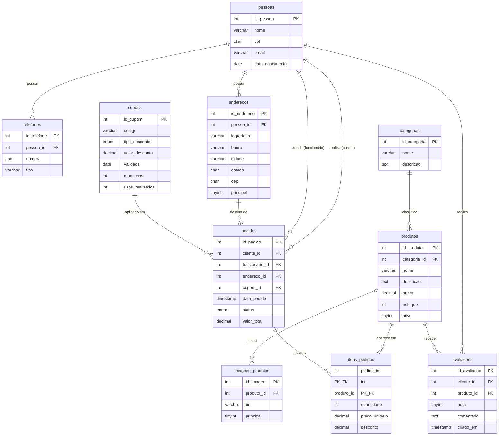

# Aula 05 — Atividade Prática: Modelagem de um Sistema de E-commerce

> **IBD015 — Banco de Dados Relacional** · Fatec Jahu · Prof. Ronan Adriel Zenatti
> [← Aula 04](./Aula_04_SQL_DML.md) · [Voltar ao README](../README.md) · [Próxima Aula →](./Aula_06_SQL_Consultas_Basicas.md)

---

## 📌 Objetivos da Aula

Esta é uma **aula de atividade prática** — o conteúdo teórico foi apresentado nas aulas anteriores. Aqui você consolidará os aprendizados das Aulas 01 a 04 desenvolvendo o modelo conceitual, lógico e DDL de um sistema de e-commerce. Esta atividade corresponde ao **Trabalho T1** da disciplina.

---

## 📋 Descrição do Trabalho T1

Você deverá projetar e implementar o banco de dados de uma loja virtual. O sistema deve contemplar as regras de negócio descritas a seguir. A entrega inclui: Diagrama Conceitual (MER), Modelo Lógico e Script DDL completo e funcional.

---

## 1. Regras de Negócio do Sistema

Leia atentamente cada regra antes de iniciar a modelagem. As regras de negócio **determinam a cardinalidade** de cada relacionamento.

**Cadastro de Pessoas:**
- O sistema mantém um cadastro unificado de pessoas (clientes e funcionários).
- Toda pessoa tem nome, CPF (único), e-mail (único), data de nascimento e pode ter múltiplos telefones.
- Um cliente pode ter múltiplos endereços cadastrados; cada endereço pertence a exatamente um cliente.

**Produtos e Categorias:**
- Cada produto pertence a exatamente uma categoria.
- Uma categoria pode ter nenhum ou muitos produtos.
- Produtos têm nome, descrição, preço, estoque e status (ativo/inativo).
- Um produto pode ter múltiplas imagens cadastradas.

**Pedidos:**
- Um cliente pode fazer nenhum ou muitos pedidos.
- Cada pedido pertence a exatamente um cliente.
- Um pedido pode ser atendido por um funcionário (opcional — pedidos online não têm atendente).
- Cada pedido tem um endereço de entrega (que deve ser um dos endereços cadastrados do cliente).
- Um pedido contém um ou mais itens; cada item referencia um produto e registra quantidade e preço no momento da compra.

**Avaliações:**
- Um cliente pode avaliar um produto somente se tiver um pedido com aquele produto com status "entregue".
- Cada avaliação tem nota (1 a 5) e comentário opcional.
- Um cliente avalia cada produto no máximo uma vez.

**Cupons de Desconto:**
- O sistema suporta cupons de desconto com código único, valor ou percentual de desconto, data de validade e quantidade máxima de usos.
- Um pedido pode ter no máximo um cupom aplicado.

---

## 2. Modelo Conceitual — Diagrama MER



---

## 3. Modelo Lógico

```
pessoas          (id_pessoa PK, nome, cpf UNIQUE, email UNIQUE, data_nascimento)
telefones        (id_telefone PK, pessoa_id FK→pessoas, numero, tipo)
enderecos        (id_endereco PK, pessoa_id FK→pessoas, logradouro, numero,
                  complemento, bairro, cidade, estado, cep, principal)

categorias       (id_categoria PK, nome UNIQUE, descricao, ativa)
produtos         (id_produto PK, categoria_id FK→categorias, nome, descricao,
                  preco, estoque, ativo)
imagens_produtos (id_imagem PK, produto_id FK→produtos, url, principal)

cupons           (id_cupom PK, codigo UNIQUE, tipo_desconto, valor_desconto,
                  validade, max_usos, usos_realizados)

pedidos          (id_pedido PK, cliente_id FK→pessoas, funcionario_id FK→pessoas NULL,
                  endereco_id FK→enderecos NULL, cupom_id FK→cupons NULL,
                  data_pedido, status, valor_total)

itens_pedidos    (pedido_id PK/FK→pedidos, produto_id PK/FK→produtos,
                  quantidade, preco_unitario, desconto)

avaliacoes       (id_avaliacao PK, cliente_id FK→pessoas, produto_id FK→produtos,
                  nota, comentario, criado_em,
                  UNIQUE(cliente_id, produto_id))
```

---

## 4. Script DDL Completo

```sql
-- =============================================================================
-- T1 — Sistema de E-commerce
-- IBD015 · FATEC Jahu · Prof. Ronan Adriel Zenatti
-- =============================================================================

DROP DATABASE IF EXISTS ecommerce;
CREATE DATABASE ecommerce
    CHARACTER SET utf8mb4
    COLLATE utf8mb4_unicode_ci;
USE ecommerce;

-- ---------------------------------------------------------------
CREATE TABLE IF NOT EXISTS pessoas (
    id_pessoa       INT UNSIGNED  NOT NULL AUTO_INCREMENT,
    nome            VARCHAR(100)  NOT NULL,
    cpf             CHAR(11)      NOT NULL,
    email           VARCHAR(255)  NOT NULL,
    data_nascimento DATE          NOT NULL,
    criado_em       TIMESTAMP     NOT NULL DEFAULT CURRENT_TIMESTAMP,
    CONSTRAINT pk_pessoa  PRIMARY KEY (id_pessoa),
    CONSTRAINT uq_cpf     UNIQUE (cpf),
    CONSTRAINT uq_email   UNIQUE (email)
) ENGINE=InnoDB DEFAULT CHARSET=utf8mb4 COLLATE=utf8mb4_unicode_ci;

-- ---------------------------------------------------------------
CREATE TABLE IF NOT EXISTS telefones (
    id_telefone INT UNSIGNED NOT NULL AUTO_INCREMENT,
    pessoa_id   INT UNSIGNED NOT NULL,
    numero      CHAR(11)     NOT NULL,
    tipo        ENUM('celular','residencial','comercial') NOT NULL DEFAULT 'celular',
    CONSTRAINT pk_telefone        PRIMARY KEY (id_telefone),
    CONSTRAINT fk_telefone_pessoa FOREIGN KEY (pessoa_id)
        REFERENCES pessoas (id_pessoa) ON DELETE CASCADE ON UPDATE CASCADE
) ENGINE=InnoDB DEFAULT CHARSET=utf8mb4 COLLATE=utf8mb4_unicode_ci;

-- ---------------------------------------------------------------
CREATE TABLE IF NOT EXISTS enderecos (
    id_endereco INT UNSIGNED  NOT NULL AUTO_INCREMENT,
    pessoa_id   INT UNSIGNED  NOT NULL,
    logradouro  VARCHAR(150)  NOT NULL,
    numero      VARCHAR(10)   NOT NULL,
    complemento VARCHAR(50)       NULL,
    bairro      VARCHAR(80)   NOT NULL,
    cidade      VARCHAR(80)   NOT NULL,
    estado      CHAR(2)       NOT NULL,
    cep         CHAR(8)       NOT NULL,
    principal   TINYINT(1)    NOT NULL DEFAULT 0,
    CONSTRAINT pk_endereco        PRIMARY KEY (id_endereco),
    CONSTRAINT fk_endereco_pessoa FOREIGN KEY (pessoa_id)
        REFERENCES pessoas (id_pessoa) ON DELETE CASCADE ON UPDATE CASCADE
) ENGINE=InnoDB DEFAULT CHARSET=utf8mb4 COLLATE=utf8mb4_unicode_ci;

-- ---------------------------------------------------------------
CREATE TABLE IF NOT EXISTS categorias (
    id_categoria INT UNSIGNED NOT NULL AUTO_INCREMENT,
    nome         VARCHAR(80)  NOT NULL,
    descricao    TEXT             NULL,
    ativa        TINYINT(1)   NOT NULL DEFAULT 1,
    CONSTRAINT pk_categoria PRIMARY KEY (id_categoria),
    CONSTRAINT uq_cat_nome  UNIQUE (nome)
) ENGINE=InnoDB DEFAULT CHARSET=utf8mb4 COLLATE=utf8mb4_unicode_ci;

-- ---------------------------------------------------------------
CREATE TABLE IF NOT EXISTS produtos (
    id_produto    INT UNSIGNED   NOT NULL AUTO_INCREMENT,
    categoria_id  INT UNSIGNED   NOT NULL,
    nome          VARCHAR(150)   NOT NULL,
    descricao     TEXT               NULL,
    preco         DECIMAL(10,2)  NOT NULL,
    estoque       INT            NOT NULL DEFAULT 0,
    ativo         TINYINT(1)     NOT NULL DEFAULT 1,
    criado_em     TIMESTAMP      NOT NULL DEFAULT CURRENT_TIMESTAMP,
    CONSTRAINT pk_produto          PRIMARY KEY (id_produto),
    CONSTRAINT fk_produto_cat      FOREIGN KEY (categoria_id)
        REFERENCES categorias (id_categoria) ON DELETE RESTRICT ON UPDATE CASCADE,
    CONSTRAINT ck_produto_preco    CHECK (preco >= 0),
    CONSTRAINT ck_produto_estoque  CHECK (estoque >= 0)
) ENGINE=InnoDB DEFAULT CHARSET=utf8mb4 COLLATE=utf8mb4_unicode_ci;

-- ---------------------------------------------------------------
CREATE TABLE IF NOT EXISTS imagens_produtos (
    id_imagem   INT UNSIGNED  NOT NULL AUTO_INCREMENT,
    produto_id  INT UNSIGNED  NOT NULL,
    url         VARCHAR(500)  NOT NULL,
    principal   TINYINT(1)    NOT NULL DEFAULT 0,
    CONSTRAINT pk_imagem         PRIMARY KEY (id_imagem),
    CONSTRAINT fk_imagem_produto FOREIGN KEY (produto_id)
        REFERENCES produtos (id_produto) ON DELETE CASCADE ON UPDATE CASCADE
) ENGINE=InnoDB DEFAULT CHARSET=utf8mb4 COLLATE=utf8mb4_unicode_ci;

-- ---------------------------------------------------------------
CREATE TABLE IF NOT EXISTS cupons (
    id_cupom        INT UNSIGNED   NOT NULL AUTO_INCREMENT,
    codigo          VARCHAR(30)    NOT NULL,
    tipo_desconto   ENUM('percentual','fixo') NOT NULL,
    valor_desconto  DECIMAL(10,2)  NOT NULL,
    validade        DATE           NOT NULL,
    max_usos        INT            NOT NULL DEFAULT 1,
    usos_realizados INT            NOT NULL DEFAULT 0,
    CONSTRAINT pk_cupom         PRIMARY KEY (id_cupom),
    CONSTRAINT uq_cupom_codigo  UNIQUE (codigo),
    CONSTRAINT ck_cupom_valor   CHECK (valor_desconto > 0),
    CONSTRAINT ck_cupom_usos    CHECK (usos_realizados <= max_usos)
) ENGINE=InnoDB DEFAULT CHARSET=utf8mb4 COLLATE=utf8mb4_unicode_ci;

-- ---------------------------------------------------------------
CREATE TABLE IF NOT EXISTS pedidos (
    id_pedido      INT UNSIGNED   NOT NULL AUTO_INCREMENT,
    cliente_id     INT UNSIGNED   NOT NULL,
    funcionario_id INT UNSIGNED       NULL,
    endereco_id    INT UNSIGNED       NULL,
    cupom_id       INT UNSIGNED       NULL,
    data_pedido    TIMESTAMP      NOT NULL DEFAULT CURRENT_TIMESTAMP,
    status         ENUM('pendente','confirmado','em_separacao',
                        'enviado','entregue','cancelado')
                                  NOT NULL DEFAULT 'pendente',
    valor_total    DECIMAL(12,2)  NOT NULL DEFAULT 0.00,
    CONSTRAINT pk_pedido             PRIMARY KEY (id_pedido),
    CONSTRAINT fk_pedido_cliente     FOREIGN KEY (cliente_id)
        REFERENCES pessoas (id_pessoa) ON DELETE RESTRICT  ON UPDATE CASCADE,
    CONSTRAINT fk_pedido_funcionario FOREIGN KEY (funcionario_id)
        REFERENCES pessoas (id_pessoa) ON DELETE SET NULL  ON UPDATE CASCADE,
    CONSTRAINT fk_pedido_endereco    FOREIGN KEY (endereco_id)
        REFERENCES enderecos (id_endereco) ON DELETE SET NULL ON UPDATE CASCADE,
    CONSTRAINT fk_pedido_cupom       FOREIGN KEY (cupom_id)
        REFERENCES cupons (id_cupom) ON DELETE SET NULL    ON UPDATE CASCADE,
    CONSTRAINT ck_pedido_valor       CHECK (valor_total >= 0)
) ENGINE=InnoDB DEFAULT CHARSET=utf8mb4 COLLATE=utf8mb4_unicode_ci;

-- ---------------------------------------------------------------
CREATE TABLE IF NOT EXISTS itens_pedidos (
    pedido_id      INT UNSIGNED   NOT NULL,
    produto_id     INT UNSIGNED   NOT NULL,
    quantidade     INT UNSIGNED   NOT NULL,
    preco_unitario DECIMAL(10,2)  NOT NULL,
    desconto       DECIMAL(5,2)   NOT NULL DEFAULT 0.00,
    CONSTRAINT pk_item_pedido   PRIMARY KEY (pedido_id, produto_id),
    CONSTRAINT fk_item_pedido   FOREIGN KEY (pedido_id)
        REFERENCES pedidos  (id_pedido)  ON DELETE CASCADE  ON UPDATE CASCADE,
    CONSTRAINT fk_item_produto  FOREIGN KEY (produto_id)
        REFERENCES produtos (id_produto) ON DELETE RESTRICT ON UPDATE CASCADE,
    CONSTRAINT ck_item_qtd      CHECK (quantidade > 0),
    CONSTRAINT ck_item_preco    CHECK (preco_unitario >= 0),
    CONSTRAINT ck_item_desc     CHECK (desconto >= 0 AND desconto <= 100)
) ENGINE=InnoDB DEFAULT CHARSET=utf8mb4 COLLATE=utf8mb4_unicode_ci;

-- ---------------------------------------------------------------
CREATE TABLE IF NOT EXISTS avaliacoes (
    id_avaliacao INT UNSIGNED NOT NULL AUTO_INCREMENT,
    cliente_id   INT UNSIGNED NOT NULL,
    produto_id   INT UNSIGNED NOT NULL,
    nota         TINYINT      NOT NULL,
    comentario   TEXT             NULL,
    criado_em    TIMESTAMP    NOT NULL DEFAULT CURRENT_TIMESTAMP,
    CONSTRAINT pk_avaliacao        PRIMARY KEY (id_avaliacao),
    CONSTRAINT uq_avaliacao        UNIQUE (cliente_id, produto_id),
    CONSTRAINT fk_aval_cliente     FOREIGN KEY (cliente_id)
        REFERENCES pessoas  (id_pessoa)  ON DELETE CASCADE ON UPDATE CASCADE,
    CONSTRAINT fk_aval_produto     FOREIGN KEY (produto_id)
        REFERENCES produtos (id_produto) ON DELETE CASCADE ON UPDATE CASCADE,
    CONSTRAINT ck_aval_nota        CHECK (nota BETWEEN 1 AND 5)
) ENGINE=InnoDB DEFAULT CHARSET=utf8mb4 COLLATE=utf8mb4_unicode_ci;
```

---

## 5. Critérios de Avaliação do T1

| Critério | Peso |
|---|---|
| Modelo conceitual correto (entidades, atributos, cardinalidades) | 30% |
| Modelo lógico com PKs, FKs e normalização adequada | 25% |
| Script DDL funcional e sem erros | 25% |
| Seguir todas as convenções de nomenclatura da disciplina | 10% |
| Comentários e organização do script | 10% |

> 💡 **Dica:** execute o script do zero em um banco limpo antes de entregar. Um DDL que não roda não pode ser avaliado completamente.

---

<div align="center">
  <sub>Fatec Jahu · IBD015 — Banco de Dados Relacional · Prof. Ronan Adriel Zenatti · 2026</sub>
</div>
