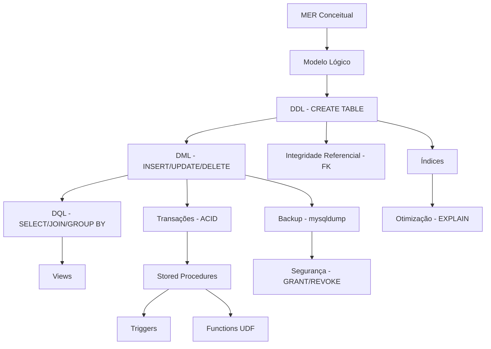
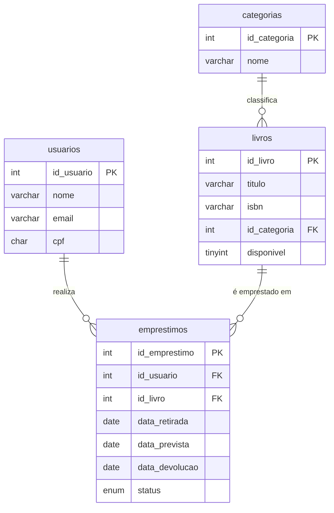

# Aula 16 — Revisão Geral

> **IBD015 — Banco de Dados Relacional** · Fatec Jahu · Prof. Ronan Adriel Zenatti
> [← Aula 15](./Aula_15_Otimizacao_Indices.md) · [Voltar ao README](../README.md) · [Próxima Aula →](./Aula_17_Trabalho_Interdisciplinar_T2.md)

---

## 📌 Objetivos da Aula

Esta aula consolida todos os tópicos do segundo bloco da disciplina (Aulas 10 a 15) por meio de exercícios integradores que combinam múltiplos conceitos em cenários realistas.

---

## 1. Mapa de Conceitos do Semestre



---

## 2. Exercício Integrador 1 — Sistema de Biblioteca

Com base no diagrama abaixo, implemente: (a) o DDL completo; (b) uma procedure para registrar empréstimo que valide se o usuário não tem mais de 3 empréstimos ativos; (c) um trigger que atualize a disponibilidade do livro automaticamente; (d) uma view para relatório de empréstimos em atraso.



---

## 3. Exercício Integrador 2 — Análise de Performance

Dadas as queries abaixo do sistema de e-commerce, execute `EXPLAIN` em cada uma e proponha melhorias:

```sql
-- Query A: relatório de vendas por categoria
SELECT c.nome AS categoria,
       COUNT(DISTINCT pd.id_pedido) AS total_pedidos,
       SUM(ip.quantidade * ip.preco_unitario) AS faturamento
FROM   categorias c
LEFT JOIN produtos p  ON p.id_categoria = c.id_categoria
LEFT JOIN itens_pedidos ip ON ip.id_produto = p.id_produto
LEFT JOIN pedidos pd ON pd.id_pedido = ip.id_pedido AND pd.status = 'entregue'
GROUP BY c.id_categoria, c.nome
ORDER BY faturamento DESC;

-- Query B: clientes sem pedido nos últimos 90 dias
SELECT pe.nome, pe.email, MAX(pd.data_pedido) AS ultimo_pedido
FROM   pessoas pe
LEFT JOIN pedidos pd ON pd.cliente_id = pe.id_pessoa
GROUP BY pe.id_pessoa, pe.nome, pe.email
HAVING ultimo_pedido < DATE_SUB(NOW(), INTERVAL 90 DAY)
    OR ultimo_pedido IS NULL;
```

---

## 4. Exercício Integrador 3 — Auditoria Completa

Implemente um sistema de auditoria para a tabela `produtos` que:
1. Registre qualquer alteração em nome, preço ou estoque
2. Registre exclusões de produtos
3. Crie uma view que mostre o histórico de alterações de preço por produto

---

## 5. Gabarito Parcial — Exercício 1

```sql
-- Procedure para registrar empréstimo com validação
DELIMITER $$
CREATE PROCEDURE sp_registrar_emprestimo (
    IN  p_id_usuario  INT UNSIGNED,
    IN  p_id_livro    INT UNSIGNED,
    IN  p_dias        INT,
    OUT p_sucesso     TINYINT,
    OUT p_mensagem    VARCHAR(255)
)
BEGIN
    DECLARE v_emprestimos_ativos INT;
    DECLARE v_disponivel         TINYINT;

    DECLARE EXIT HANDLER FOR SQLEXCEPTION
    BEGIN ROLLBACK; SET p_sucesso = 0; SET p_mensagem = 'Erro interno.'; END;

    START TRANSACTION;

    SELECT COUNT(*) INTO v_emprestimos_ativos
    FROM   emprestimos
    WHERE  id_usuario = p_id_usuario AND status = 'ativo';

    SELECT disponivel INTO v_disponivel
    FROM   livros WHERE id_livro = p_id_livro FOR UPDATE;

    IF v_emprestimos_ativos >= 3 THEN
        ROLLBACK;
        SET p_sucesso = 0; SET p_mensagem = 'Limite de 3 empréstimos ativos atingido.';
    ELSEIF v_disponivel = 0 THEN
        ROLLBACK;
        SET p_sucesso = 0; SET p_mensagem = 'Livro não disponível.';
    ELSE
        INSERT INTO emprestimos (id_usuario, id_livro, data_retirada, data_prevista, status)
        VALUES (p_id_usuario, p_id_livro, CURDATE(), DATE_ADD(CURDATE(), INTERVAL p_dias DAY), 'ativo');

        UPDATE livros SET disponivel = 0 WHERE id_livro = p_id_livro;

        COMMIT;
        SET p_sucesso = 1; SET p_mensagem = 'Empréstimo registrado com sucesso.';
    END IF;
END$$
DELIMITER ;
```

---

> **Próxima aula:** [Aula 17 — Trabalho Interdisciplinar T2](./Aula_17_Trabalho_Interdisciplinar_T2.md)

---

<div align="center">
  <sub>Fatec Jahu · IBD015 — Banco de Dados Relacional · Prof. Ronan Adriel Zenatti · 2026</sub>
</div>
