# Aula 17 — T2: Trabalho Interdisciplinar

> **IBD015 — Banco de Dados Relacional** · Fatec Jahu · Prof. Ronan Adriel Zenatti
> [← Aula 16](./Aula_16_Revisao_Geral.md) · [Voltar ao README](../README.md) · [Próxima Aula →](./Aula_18_Avaliacao_P2.md)

---

## 📌 Descrição do Trabalho T2

O Trabalho 2 é um **Projeto Interdisciplinar** integrado com as disciplinas de **Desenvolvimento Web II** e **Engenharia de Software II**. O banco de dados implementado aqui é o backend de dados do sistema que você está desenvolvendo nas outras disciplinas.

**Valor:** 2 pontos | **Avaliação em pares com rubrica** | **Válido para Portfólio Digital**

---

## 1. Requisitos Obrigatórios

O projeto deve conter todos os itens abaixo para ser avaliado completamente:

**Modelagem:**
- Diagrama Conceitual (MER) com todas as entidades, atributos e cardinalidades
- Modelo Lógico com PKs, FKs e tabelas intermediárias devidamente identificadas
- Normalização até a 3FN demonstrada e justificada

**Implementação DDL:**
- Script DDL completo, funcional e sem erros
- Seguindo todas as convenções de nomenclatura da disciplina
- Charset e collation corretos (`utf8mb4` / `utf8mb4_unicode_ci`)
- Todas as constraints relevantes (PK, FK com ON DELETE/UPDATE, UNIQUE, CHECK)

**Programação no banco:**
- Mínimo de **2 Stored Procedures** com tratamento de erros e transações
- Mínimo de **2 Triggers** (ao menos um BEFORE e um AFTER)
- Mínimo de **1 Function** usada em alguma consulta

**Relatórios e Consultas:**
- Mínimo de **3 Views** para relatórios relevantes ao sistema
- Mínimo de **5 consultas complexas** com JOIN, GROUP BY e/ou subconsultas
- Ao menos uma query com otimização demonstrada via `EXPLAIN`

**Backup e Segurança:**
- Script de backup (`mysqldump`) documentado
- Criação de ao menos 2 usuários com diferentes níveis de acesso

**Documentação:**
- README do projeto explicando o domínio do sistema
- Diagrama MER em Mermaid ou imagem
- Instruções de como executar o script

---

## 2. Rubrica de Avaliação

| Critério | Insuficiente (0) | Regular (0.5) | Bom (0.75) | Excelente (1.0) |
|---|---|---|---|---|
| Modelagem | Incompleta ou incorreta | Entidades corretas, cardinalidades com erros | Modelo correto com pequenos ajustes | Modelo completo, correto e bem justificado |
| DDL | Não roda ou com erros graves | Roda com erros menores | Roda corretamente, algumas convenções violadas | Completo, sem erros, todas as convenções |
| Procedures/Triggers | Ausentes | Presentes sem tratamento de erro | Funcionais com tratamento básico | Completos, com transações e tratamento robusto |
| Views e Consultas | Ausentes ou triviais | Presentes mas simples | Consultas com JOIN e agregação | Consultas complexas e otimizadas |
| Backup e Segurança | Ausente | Backup sem opções recomendadas | Backup correto, usuários sem granularidade | Backup completo + usuários com mínimo privilégio |
| Documentação | Ausente | README básico | README completo sem diagrama | README + diagrama + instruções claras |

---

## 3. Dicas para um Projeto de Qualidade

```mermaid
graph LR
    A[Entenda o domínio] --> B[Modelagem conceitual]
    B --> C[Revise cardinalidades]
    C --> D[Normalize até 3FN]
    D --> E[Escreva o DDL]
    E --> F[Teste o DDL do zero]
    F --> G[Implemente procedures]
    G --> H[Adicione triggers]
    H --> I[Crie as views]
    I --> J[Teste tudo junto]
    J --> K[Documente]
    K --> L[Entrega]
```

**Teste o script do zero:** antes de entregar, delete o banco, execute o script completo e verifique se tudo funciona. Um DDL que não roda não pode ser avaliado completamente.

**Integre com as outras disciplinas:** o banco deve suportar as funcionalidades do sistema que você está desenvolvendo nas outras disciplinas — as tabelas e views devem refletir o que a aplicação web precisará.

---

> **Próxima aula:** [Aula 18 — Avaliação P2](./Aula_18_Avaliacao_P2.md)

---

  Fatec Jahu · IBD015 — Banco de Dados Relacional · Prof. Ronan Adriel Zenatti · 2026

