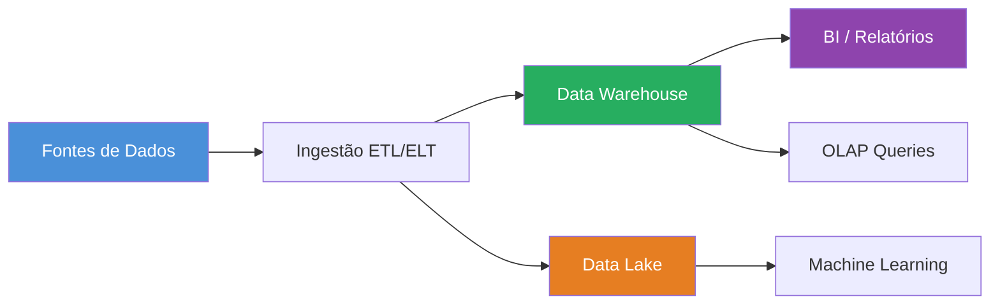
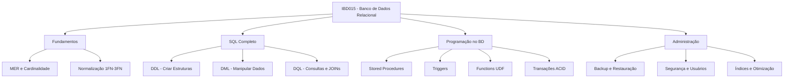

# Aula 20 — Novas Tecnologias em BD e Encerramento

> **IBD015 — Banco de Dados Relacional** · Fatec Jahu · Prof. Ronan Adriel Zenatti
> [← Aula 19](./Aula_19_Avaliacao_Substitutiva.md) · [Voltar ao README](../README.md)

---

## 📌 Objetivos da Aula

Esta aula apresenta um panorama das tendências em banco de dados que você encontrará no mercado: NewSQL, DBaaS, Big Data e bancos NoSQL. O objetivo não é dominar esses temas aqui — eles serão aprofundados em IBD-016 — mas compreender quando e por que cada tecnologia existe, e como o conhecimento de BD Relacional é o alicerce para aprender todas as outras.

---

## 🧭 O Cenário Atual

O modelo relacional, criado por Edgar Codd em 1970, ainda é a base da maioria dos sistemas transacionais do mundo. Mas o surgimento de novos paradigmas de aplicação — redes sociais com bilhões de usuários, IoT gerando dados em tempo real, e-commerce em escala global — criou demandas que os SGBDs relacionais tradicionais atendiam com dificuldade. Dessa tensão surgiram as novas tecnologias que veremos hoje.

[prompt para nanobanana: "Timeline diagram showing database technology evolution. Start at 1970 with 'Modelo Relacional (Codd)' with SQL icon. Then 1980s 'RDBMS Comerciais (Oracle, DB2)'. Then 2000s 'Open Source (MySQL, PostgreSQL)'. Then 2009 'NoSQL movement (MongoDB, Cassandra, Redis)' with document/key-value icons. Then 2012 'NewSQL (Google Spanner, CockroachDB)'. Then 2015 'DBaaS Cloud (RDS, Cloud SQL, Supabase)'. Then 2020+ 'AI-integrated databases, vector stores'. Clean horizontal timeline, blue gradient, white background, Portuguese labels."]


---

## 1. NewSQL — O Melhor dos Dois Mundos

**O problema:** os SGBDs relacionais tradicionais têm dificuldade de escalar horizontalmente (adicionar mais máquinas). Para crescer, geralmente escalam verticalmente (máquina maior e mais cara). Bancos NoSQL resolveram a escalabilidade mas abriram mão da consistência e do SQL.

**A solução NewSQL:** sistemas que mantêm as garantias do modelo relacional (ACID, SQL) mas com arquitetura distribuída que permite escala horizontal massiva.

| Sistema NewSQL | Empresa | Destaque |
|---|---|---|
| Google Spanner | Google | BD distribuído globalmente com consistência forte |
| CockroachDB | Cockroach Labs | Open source, compatível com PostgreSQL |
| TiDB | PingCAP | Compatível com MySQL, HTAP (transacional + analítico) |
| YugabyteDB | Yugabyte | Open source, PostgreSQL + Cassandra |

---

## 2. DBaaS — Banco de Dados como Serviço

DBaaS (*Database as a Service*) elimina a necessidade de gerenciar servidores, atualizações, backups e alta disponibilidade — você apenas usa o banco.

[prompt para nanobanana: "Cloud service architecture diagram showing DBaaS concept. On-premise side (left, darker): shows developer managing server hardware, OS installation, SGBD installation, backups, updates, high availability with many manual steps. DBaaS side (right, lighter cloud): shows developer only connecting to a cloud database icon, with provider handling infrastructure, backups, scaling, and updates automatically. Arrow labeled 'DBaaS elimina' pointing from left complexity to right simplicity. Clean flat design, blue cloud theme, white background, Portuguese labels."]


| Plataforma | SGBD | Gratuito? |
|---|---|---|
| AWS RDS | MySQL, PostgreSQL, MariaDB, SQL Server | Free tier (limitado) |
| Google Cloud SQL | MySQL, PostgreSQL, SQL Server | Free tier |
| Azure Database | MySQL, PostgreSQL, MariaDB | Free tier |
| Supabase | PostgreSQL | Plano gratuito generoso |
| PlanetScale | MySQL (Vitess) | Plano gratuito |
| Neon | PostgreSQL | Plano gratuito serverless |

> 💡 **Para os seus projetos:** Supabase e Neon são excelentes opções gratuitas para hospedar o banco do T2 e do portfólio. Ambos têm interface web, suporte a SQL padrão e integração com frameworks modernos.

---

## 3. Big Data e Bancos Analíticos

Quando os dados são grandes demais para caber em um único servidor ou quando as consultas são analíticas (lendo bilhões de linhas para gerar relatórios), entram os bancos analíticos e as ferramentas de Big Data.



| Ferramenta | Tipo | Caso de uso |
|---|---|---|
| Apache Hadoop | Processamento distribuído | Processamento de logs em escala |
| Apache Spark | Processamento em memória | ML e transformação de dados |
| Google BigQuery | Data Warehouse serverless | Análise de terabytes com SQL |
| Amazon Redshift | Data Warehouse | BI corporativo |
| Snowflake | Data Warehouse cloud | Separação de armazenamento e compute |
| ClickHouse | OLAP columnar | Análises em tempo real |

---

## 4. Introdução a Bancos Não Relacionais (NoSQL)

Os bancos NoSQL existem em quatro categorias principais, cada uma otimizada para um tipo diferente de dado ou padrão de acesso.

[prompt para nanobanana: "Four-panel diagram showing NoSQL database categories with icons and examples. Panel 1 'Documentos': JSON document icon, examples MongoDB/CouchDB, use case 'Catálogos de produtos, perfis de usuário'. Panel 2 'Chave-Valor': key-value pair icon, examples Redis/DynamoDB, use case 'Cache, sessões, filas'. Panel 3 'Colunar': column family icon, examples Cassandra/HBase, use case 'IoT, logs, séries temporais'. Panel 4 'Grafos': network graph icon, examples Neo4j/ArangoDB, use case 'Redes sociais, recomendações'. Clean flat design, different color for each panel, white background, Portuguese labels."]


### 4.1 Quando usar NoSQL?

```
Use Relacional quando:
✅ Os dados têm estrutura bem definida e estável
✅ Há muitas relações entre entidades
✅ Consistência absoluta é obrigatória (financeiro, saúde)
✅ Queries complexas com JOINs e agregações são frequentes

Use NoSQL quando:
✅ O schema muda frequentemente (dados semiestruturados)
✅ Escala horizontal massiva é necessária
✅ Alta disponibilidade com eventual consistency é aceitável
✅ O modelo de dados é específico (grafos, séries temporais, cache)
```

### 4.2 Pré-visualização de MongoDB (próxima disciplina: IBD-016)

```javascript
// Exemplo: inserindo um produto com estrutura flexível
// Observe: não há schema fixo — cada documento pode ter campos diferentes
db.produtos.insertOne({
  nome: "Notebook Lenovo",
  preco: 3499.90,
  categoria: "Eletrônicos",
  especificacoes: {        // documento aninhado — não existe no relacional
    processador: "Intel i5",
    ram: "8GB",
    armazenamento: "SSD 256GB"
  },
  imagens: [               // array — não existe no relacional sem tabela extra
    "img1.jpg",
    "img2.jpg"
  ]
})

// Equivalente SQL que precisaria de 3 tabelas e 2 JOINs para o mesmo resultado:
// SELECT p.*, e.*, i.url FROM produtos p
// LEFT JOIN especificacoes e ON e.id_produto = p.id_produto
// LEFT JOIN imagens i ON i.id_produto = p.id_produto
```

---

## 5. O Futuro: Bancos de Dados com IA Integrada

Uma tendência emergente são os bancos com suporte nativo a **busca vetorial** — essencial para sistemas de recomendação, pesquisa semântica e aplicações de IA generativa (RAG — Retrieval-Augmented Generation).

```sql
-- PostgreSQL com extensão pgvector: busca por similaridade semântica
-- Exemplo: encontrar produtos similares a uma descrição em linguagem natural
SELECT nome, descricao,
       embedding <-> '[0.1, 0.5, 0.3, ...]'::vector AS distancia
FROM produtos
ORDER BY distancia
LIMIT 5;
```

| Banco com suporte vetorial | Base |
|---|---|
| pgvector (extensão) | PostgreSQL |
| MongoDB Atlas Vector Search | MongoDB |
| Pinecone | Especializado em vetores |
| Weaviate | Especializado em vetores |
| Qdrant | Especializado em vetores |

---

## 6. Encerramento do Semestre

### O que você aprendeu



### Próximos Passos — IBD-016

Na próxima disciplina, **Banco de Dados Não Relacional**, você irá:
- Aprofundar o MongoDB e o paradigma de documentos
- Trabalhar com Redis para cache e estruturas de dados em memória
- Entender modelagem de dados para NoSQL (desnormalização intencional)
- Comparar estratégias de modelagem relacional vs documental

### Orientações sobre o Portfólio Digital

Os trabalhos T1 e T2 são candidatos ao seu Portfólio Digital. Certifique-se de que:
- O código está no GitHub com README bem escrito
- O diagrama MER está documentado
- O script DDL é executável do zero
- As procedures, triggers e functions estão comentadas

---

## 7. Recursos para Continuar Aprendendo

- 📖 [SQLBolt](https://sqlbolt.com) — exercícios interativos de SQL
- 📖 [Mode SQL Tutorial](https://mode.com/sql-tutorial/) — SQL para análise de dados
- 📖 [Use The Index, Luke](https://use-the-index-luke.com) — guia de otimização com índices
- 📖 [Documentação oficial MariaDB](https://mariadb.com/kb/en/)
- 📖 [Supabase Docs](https://supabase.com/docs) — PostgreSQL gerenciado para projetos reais
- 🎓 [Khan Academy — SQL](https://www.khanacademy.org/computing/computer-programming/sql) — revisão gratuita

---

## 📚 Referências desta Aula

- ELMASRI, R.; NAVATHE, S. B. *Sistemas de Banco de Dados*. 7 ed. Cap. 24 — Sistemas de Banco de Dados Emergentes. São Paulo: Pearson, 2018.
- SADALAGE, P.; FOWLER, M. *NoSQL Distilled*. Addison-Wesley, 2012.

---

> Este é o encerramento da disciplina IBD015. Bom semestre e bons estudos na continuação!

---

<div align="center">
  <sub>Fatec Jahu · IBD015 — Banco de Dados Relacional · Prof. Ronan Adriel Zenatti · 2026</sub>
</div>
